# Ghar Wapasi — Frontend Architecture & Flow Specification

> **Complete technical reference for the current frontend build.**
> Ye document poore frontend ko document karta hai — architecture, design system, routing, data model, har form ke fields + validation, har user journey, business rules, aur backend integration ke liye exact points.
>
> Isko padhne ke liye: agar aap sirf "kya kya hai" dekhna chahte ho to Section 2 (Architecture) se shuru karein. Agar aap backend apply kar rahe ho to Section 15 (Backend Integration Points) seedha padhein.

| Item | Value |
|---|---|
| Project | `ghar-wapasi-ui` |
| Build | Vite 8.2.2 + React 19 + TypeScript |
| Styling | Tailwind CSS v4 (`@theme` tokens, no config file) |
| Routing | React Router v7 (`useRoutes`, data-less config) |
| Toasts | `sonner` (rich colours, auto theme sync) |
| State | React `useSyncExternalStore` over `localStorage` — **no Redux, no server state** |
| Diagrams | Mermaid (renders on GitHub, VS Code, Notion) |
| Doc version | 1.0 |
| Last verified against code | Session 2026-09-27 — `npm run lint` ✅, `npm run build` ✅ |

---

## Table of Contents

1. [Product Summary](#1-product-summary)
2. [System Architecture](#2-system-architecture)
3. [Design System](#3-design-system)
4. [Routing Map](#4-routing-map)
5. [Data Layer & Persistence](#5-data-layer--persistence)
6. [Entity Data Dictionary](#6-entity-data-dictionary)
7. [Authentication & Session Model](#7-authentication--session-model)
8. [Journey 1 — Citizen Complaint Registration](#8-journey-1--citizen-complaint-registration)
9. [Journey 2 — Police / NGO Verification Lifecycle](#9-journey-2--police--ngo-verification-lifecycle)
10. [Journey 3 — Admin Verification Console](#10-journey-3--admin-verification-console)
11. [Journey 4 — Report → Review → Suspension](#11-journey-4--report--review--suspension)
12. [Complete Form Inventory](#12-complete-form-inventory)
13. [Page Inventory](#13-page-inventory)
14. [Business Rules Reference](#14-business-rules-reference)
15. [Backend Integration Points](#15-backend-integration-points)
16. [Known Gaps, Risks & Deviations](#16-known-gaps-risks--deviations)
17. [File Index](#17-file-index)

---

## 1. Product Summary

**Ghar Wapasi** is a citizen-led missing-person platform for India. Four user types share **one login page**; the role decides which portal opens.

| Role | `UserRole` | Label shown | Home route | What they do |
|---|---|---|---|---|
| Public / Citizen | `public` | Public user | `/public/dashboard` | Register missing-person complaints, track them, browse community reports |
| Police | `police` | Police officer | `/police/dashboard` | Register as an officer, get admin-verified, then log complaints at a station desk |
| NGO | `ngo` | NGO member | `/ngo/dashboard` | Register an organisation, get admin-verified, then coordinate community cases |
| Admin | `admin` | Verification admin | `/admin/dashboard` | Verify police/NGO accounts over a video call, track their cases, handle reports, suspend accounts |

**Key product principles baked into the UI:**

- **One login for everyone.** No role picker, no separate admin login. The backend (or the demo resolver) decides the role.
- **The admin gives the meeting link and time. The user never does.** Approval is blocked until a call is scheduled. This is enforced in the data layer, not just the UI.
- **Every admin is equal.** There is no super admin. Scoping is strict: an admin only sees accounts they personally verified.
- **Two humans on every complaint.** A second family member must be Aadhaar + OTP verified before a complaint can be filed.
- **FIR copy is mandatory.** No police complaint copy → complaint cannot be accepted.
- **Admin panel has its own colour.** Violet (`--color-admin-*`) vs citizen blue (`--color-brand-*`) so an admin never confuses the two.

---

## 2. System Architecture

### 2.1 Layer diagram

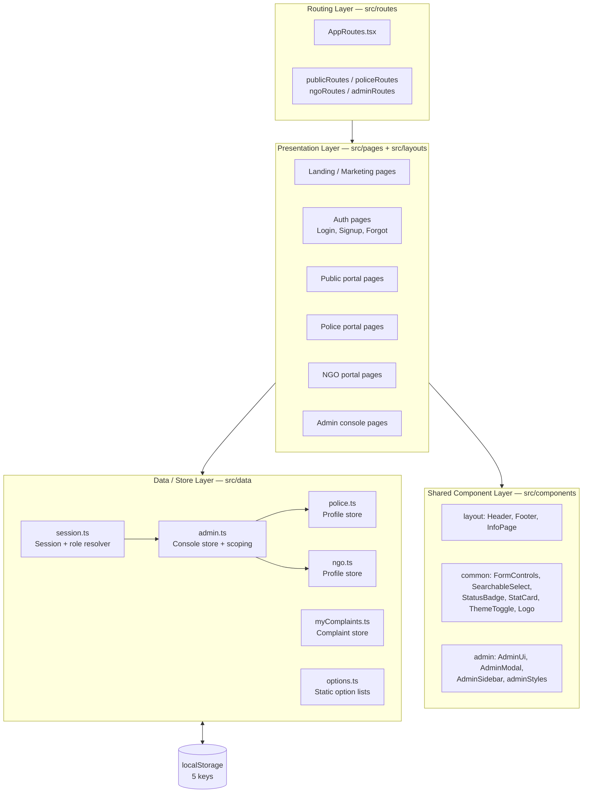

### 2.2 Store pattern (used by every data module)

There is exactly one store pattern in this codebase. It is a hand-rolled external store consumed through `useSyncExternalStore`.

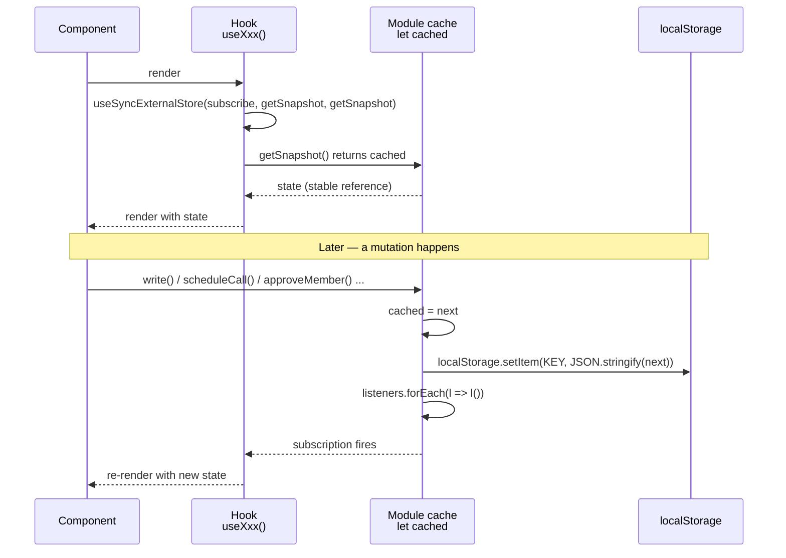

**Why this matters for the backend:** every data module already exposes a narrow mutation API (`approveMember`, `setCaseOutcome`, `submitPoliceRegistration`, …). When the backend arrives, you replace the body of each mutation with an API call and keep the hook signature. **No component needs to change.**

### 2.3 Rendering / bootstrap

| Concern | Implementation |
|---|---|
| Entry | `src/main.tsx` — `createRoot` → `StrictMode` → `BrowserRouter` → `App` |
| Global CSS | `src/index.css` imported once in `main.tsx` |
| Route table | `src/routes/AppRoutes.tsx` → `useRoutes([...])` |
| Toasts | `ThemedToaster` in `App.tsx` — `MutationObserver` watches `documentElement.class` and flips the `sonner` theme between `light` and `dark` |
| Page titles | `Header.tsx` `useEffect` sets `document.title` from the matched portal prefix |

### 2.4 Complete file tree

```text
src/
├── main.tsx                      Entry point
├── App.tsx                       Toaster + routes
├── index.css                     Tailwind v4 @theme, dark palette, admin-surface
│
├── routes/
│   ├── AppRoutes.tsx             Master route table
│   ├── publicRoutes.tsx          /public/*
│   ├── policeRoutes.tsx          /police/*
│   ├── ngoRoutes.tsx             /ngo/*
│   └── adminRoutes.tsx           /admin/*
│
├── layouts/
│   ├── AdminLayout.tsx           Guarded admin shell (sidebar + page meta)
│   ├── PanelLayout.tsx           Shared public/police/NGO shell
│   ├── PublicLayout.tsx          PanelLayout + showSignOut
│   ├── PoliceLayout.tsx          PanelLayout + showSignOut
│   └── NgoLayout.tsx             PanelLayout + showSignOut
│
├── data/                         ── All state lives here ──
│   ├── session.ts                Unified session + role resolver
│   ├── admin.ts                  Admin console store (members/cases/reports/suspensions)
│   ├── police.ts                 Police profile store
│   ├── ngo.ts                    NGO profile store
│   ├── myComplaints.ts           Complaint store + helpers
│   └── options.ts                Static dropdown data
│
├── components/
│   ├── layout/                   Header, Footer, InfoPage
│   ├── common/                   FormControls, SearchableSelect, StatusBadge,
│   │                             StatCard, ThemeToggle, Logo, formStyles
│   └── admin/                    AdminUi, AdminModal, AdminSidebar, adminStyles
│
└── pages/
    ├── landing/LandingPage.tsx
    ├── auth/                     LoginPage, SignupPage, ForgotPasswordPage
    ├── public/                   PublicDashboard, MyComplaintsPage,
    │                             MyComplaintDetailPage, RegisterComplaintPage,
    │                             AboutPage, GuidelinesPage, ContactPage, PrivacyPage
    ├── police/                   PoliceDashboard, PoliceRegisterPage, PoliceStatusPage
    ├── ngo/                      NgoDashboard, NgoRegisterPage, NgoStatusPage
    ├── admin/                    AdminDashboard, VerificationRequestsPage,
    │                             MyUsersPage, ReportsPage, SuspensionsPage
    └── NotFound/NotFoundPage.tsx
```

---

## 3. Design System

### 3.1 Colour tokens

Two independent ramps. **The admin console deliberately uses violet, not blue**, so it is visually unmistakable from citizen-facing screens.

| Token family | Purpose | Key values |
|---|---|---|
| `--color-brand-*` | Citizen site, police, NGO, all public flows | `600: #2563eb`, `500: #3b82f6`, `700: #1d4ed8`, full 50→950 ramp |
| `--color-admin-*` | **Admin console only** | `600: #7c3aed`, `700: #6d28d9`, `300: #c4b5fd`, `400: #a78bfa`, full 50→950 ramp |
| `--color-canvas` | Page background | light `#f2f4f7` · dark `#09090b` · **admin light `#f7f5fd`** · **admin dark `#0d0b14`** |
| `--color-surface` | Card background | light `#ffffff` · dark `#101013` |

The admin canvas tint is applied by a single class:

```css
.admin-surface        { --color-canvas: #f7f5fd; }
.dark .admin-surface  { --color-canvas: #0d0b14; }
```

`AdminLayout` puts `admin-surface` on its root element — that is the *only* reason the admin canvas looks different.

### 3.2 Typography

| Token | Family | Weights | Usage |
|---|---|---|---|
| `--font-sans` | DM Sans | 400, 500, 600, 700 | Body, labels, tables |
| `--font-display` | Manrope | 600, 700, 800 | Headings, stat numbers (always with `tabular-nums`) |
| `--font-serif` | Fraunces | 500, 600 italic | Hero accent word only ("*way home*") |

Loaded from Google Fonts with a single `@import` at the top of `index.css`.

### 3.3 Dark mode

- **Mechanism:** a `.dark` class on `<html>` — **not** `prefers-color-scheme`.
- **Custom variant:** `@custom-variant dark (&:where(.dark, .dark *))` so `dark:` utilities only react to the class.
- **Toggle:** `ThemeToggle.tsx` reads `localStorage.getItem('theme') ?? 'dark'`, toggles the class, writes `'dark' | 'light'`.
- **Default on first visit: dark.**
- Dark mode **inverts the slate ramp** (900 becomes near-white, 200 becomes near-black) so existing `text-slate-900` / `bg-slate-100` utilities flip automatically without per-component overrides.
- Dark mode also re-declares `brand-50…600` and `admin-50…600` with darkened backgrounds + brightened foregrounds.

### 3.4 Status → colour mapping (all three portals)

| Status token | Citizen (`StatusBadge`) | Admin (`Pill`) | Police/NGO label |
|---|---|---|---|
| `Active` | amber | — | — |
| `Matched` | brand blue | — | — |
| `Resolved` | slate | — | — |
| `pending` | — | `amber` (stat) / `slate` (row) | `Pending admin approval` |
| `verified` | — | `emerald` | `Verified` |
| `rejected` | — | `rose` | `Rejected` |
| `open` (report) | — | `rose` → text `New` | — |
| `reviewing` | — | `amber` → text `Under review` | — |
| `closed` (report) | — | `emerald` → text `Closed` | — |
| `found` (case) | — | `emerald` | — |
| `not-found` | — | `rose` | — |
| `open` (case) | — | `amber` → text `Still searching` | — |
| `active` (suspension) | — | `rose` | — |
| `lifted` | — | `emerald` | — |

### 3.5 Shared component API

**`src/components/common/FormControls.tsx`**

| Component | Props | Behaviour |
|---|---|---|
| `Field` | `label`, `required?`, `hint?`, `children` | Renders uppercase `text-xs` label + rose `*` when required + hint paragraph below |
| `TextInput` | `value`, `onChange(value)`, `placeholder?`, `type?`, `inputMode?`, `maxLength?` | Controlled; `onChange` receives the **string**, not the event |
| `TextAreaInput` | `value`, `onChange`, `placeholder?` | `min-h-[92px]`, resizable |
| `SelectInput` | `value`, `onChange`, `options[]`, `placeholder?` | Adds an empty first option |
| `PhotoUpload` | `label`, `hint`, `required?`, `files: File[]`, `onChange(File[])` | Dashed dropzone, `accept="image/*"`, `multiple`, appends, per-file remove `×` |
| `OtpBlock` | `aadhaar`, `mobile`, `sent`, `code`, `verified`, `onSend`, `onCodeChange`, `onVerify`, `requireAadhaar?` | Send button disabled until Aadhaar (12) + mobile (10) are valid; verified state collapses to a green check row |
| `ConsentCheckbox` | `checked`, `onChange(bool)`, `children` | Full-width bordered card, `accent-brand-600` |

**`src/components/common/SearchableSelect.tsx`** — single-select combobox with a search input. Filters on `option.toLowerCase().includes(search)`. Closes on outside `pointerdown`. Empty result shows `No matches found`. Props: `value`, `onChange`, `options[]`, `placeholder`, `searchPlaceholder`.

**`src/components/admin/AdminUi.tsx`** — the admin design system.

| Export | Props | Notes |
|---|---|---|
| `ConsoleStat` | `label`, `value`, `detail`, `tone?` | `tone: 'default' \| 'admin' \| 'amber' \| 'rose' \| 'emerald'`, default `default` |
| `SectionCard` | `title`, `subtitle?`, `action?`, `children` | Header row + action slot |
| `Pill` | `children`, `tone?` | `tone: 'slate' \| 'admin' \| 'amber' \| 'rose' \| 'emerald'`, default `slate` |
| `DetailRow` | `label`, `value: ReactNode` | Label/value pair for modals |
| `ActionButton` | `variant?`, plus button props | `variant: 'admin' \| 'ghost' \| 'emerald' \| 'rose' \| 'amber'`, default `admin` |

**`src/components/admin/AdminModal.tsx`** — props `open`, `title`, `description?`, `onClose`, `children`, `footer?`. Renders `null` when closed. **Bottom sheet on mobile** (`items-end`, `rounded-t-2xl`, `max-h-[92dvh]`), centred dialog from `sm` up (`max-h-[88dvh]`, `max-w-2xl`). Body scrolls with `overscroll-contain`; footer stacks full-width on mobile and goes right-aligned on `sm`.

**`src/components/admin/adminStyles.ts`**
- `filterChipClass(active: boolean): string` — the shared active/inactive pill used by every admin filter row.
- `adminLinkClass` — the violet "Open queue" / "All reports" / "Open list" link style.

**`src/components/layout/Header.tsx`** — the site-wide header. Portal pill, Home link, account menu, theme toggle, notification bell. See §7.5 for the account menu.

---

## 4. Routing Map

### 4.1 Complete route table

| Path | Component | Layout | Guard |
|---|---|---|---|
| `/` | `LandingPage` | own header | none |
| `/signup` | `SignupPage` | own header | none |
| `/login` | `LoginPage` | own header | none |
| `/forgot-password` | `ForgotPasswordPage` | own header | none |
| `/about` | `AboutPage` | `InfoPage` | none |
| `/guidelines` | `GuidelinesPage` | `InfoPage` | none |
| `/contact` | `ContactPage` | `InfoPage` | none |
| `/privacy-policy` | `PrivacyPage` | `InfoPage` | none |
| `/not-found` | `NotFoundPage` | own | none |
| `*` | `NotFoundPage` | own | none |
| `/public` | → redirect `dashboard` | `PublicLayout` | — |
| `/public/dashboard` | `PublicDashboard` | `PublicLayout` | none |
| `/public/my-complaints` | `MyComplaintsPage` | `PublicLayout` | none |
| `/public/my-complaints/:id` | `MyComplaintDetailPage` | `PublicLayout` | none |
| `/public/register-complaint` | `RegisterComplaintPage` | `PublicLayout` | none |
| `/police` | → redirect `dashboard` | `PoliceLayout` | — |
| `/police/dashboard` | `PoliceDashboard` | `PoliceLayout` | none |
| `/police/register` | `PoliceRegisterPage` | `PoliceLayout` | none |
| `/police/status` | `PoliceStatusPage` | `PoliceLayout` | none |
| `/police/register-complaint` | `RegisterComplaintPage` (desk variant) | `PoliceLayout` | none |
| `/police/complaints/:id` | `MyComplaintDetailPage` | `PoliceLayout` | none |
| `/ngo` | → redirect `dashboard` | `NgoLayout` | — |
| `/ngo/dashboard` | `NgoDashboard` | `NgoLayout` | none |
| `/ngo/register` | `NgoRegisterPage` | `NgoLayout` | none |
| `/ngo/status` | `NgoStatusPage` | `NgoLayout` | none |
| `/ngo/complaints/:id` | `MyComplaintDetailPage` | `NgoLayout` | none |
| `/admin` | → redirect `dashboard` | `AdminLayout` | **`useCurrentAdmin()` → `/login`** |
| `/admin/dashboard` | `AdminDashboard` | `AdminLayout` | same |
| `/admin/requests` | `VerificationRequestsPage` | `AdminLayout` | same |
| `/admin/my-users` | `MyUsersPage` | `AdminLayout` | same |
| `/admin/reports` | `ReportsPage` | `AdminLayout` | same |
| `/admin/suspensions` | `SuspensionsPage` | `AdminLayout` | same |

**22 explicit routes + 2 catch-alls.**

### 4.2 Route → portal diagram

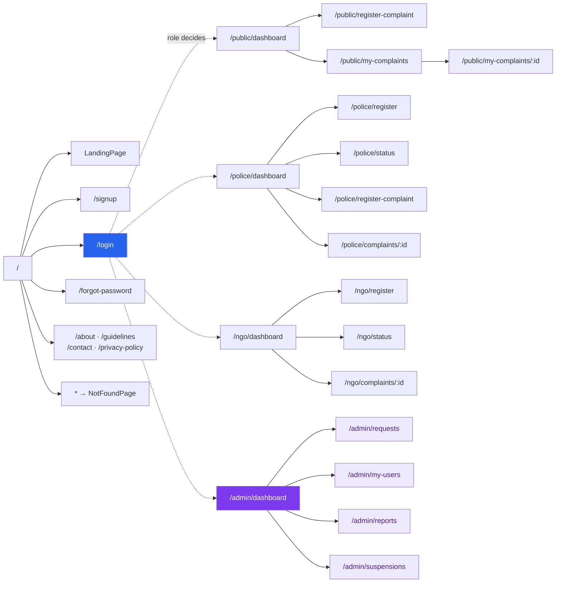

### 4.3 Reused pages with variant props

Two pages are mounted at multiple routes and change behaviour purely through props.

| Page | Prop | Default | Police override | NGO override |
|---|---|---|---|---|
| `RegisterComplaintPage` | `backTo` | `/public/dashboard` | `/police/dashboard` | — |
| | `backLabel` | `Back to Dashboard` | `Back to Police Portal` | — |
| | `redirectTo` | → `/public/my-complaints/:id` | `/police/dashboard` | — |
| | `heading` | `Register a Missing Person Complaint` | `Register a Complaint (Police Desk)` | — |
| | `description` | FIR-mandatory copy | Police-desk variant | — |
| `MyComplaintDetailPage` | `backTo` | `/public/my-complaints` | `/police/dashboard` | `/ngo/dashboard` |
| | `backLabel` | `All Complaints` | `Back to Police Portal` | `Back to NGO Portal` |
| | `newComplaintTo` | `/public/register-complaint` | `/police/register-complaint` | *(unused)* |
| | `showNewComplaint` | `true` | `true` | **`false`** |

The NGO portal is **read-only for case creation** — NGOs coordinate existing cases, they do not file new ones.

### 4.4 Admin route guard

```mermaid
flowchart TD
    HIT["AdminLayout mounts on /admin/*"] --> CLS{"useCurrentAdmin()"}
    CLS --> "session.role === 'admin' ?" -->|no| NAV["&lt;Navigate to='/login' replace /&gt;"]
    CLS -->|"id found in state.admins"| FOUND["Render sidebar + &lt;Outlet/&gt;"]
    FOUND --> SYNC["useEffect once: syncLocalRegistrations()"]
    SYNC --> PAGE["Admin page renders with scoped data"]

    style NAV fill:#e11d48,color:#fff
    style PAGE fill:#7c3aed,color:#fff
```

Each admin page **also** self-guards with `if (!admin) return null` as a second line of defence.

---

## 5. Data Layer & Persistence

### 5.1 `localStorage` keys

| Key | Module | Shape | Seeded? |
|---|---|---|---|
| `gw-session` | `session.ts` | `Session` object | no |
| `gw-admin-console-v2` | `admin.ts` | `AdminConsoleState` | yes — 3 admins, 8 members, 7 cases, 5 reports, 1 suspension |
| `gw-police-profile` | `police.ts` | `PoliceProfile` | no — created on first police registration |
| `gw-ngo-profile` | `ngo.ts` | `NgoProfile` | no — created on first NGO registration |
| `theme` | `ThemeToggle.tsx` | `'dark' \| 'light'` | defaults to `'dark'` |

> ⚠️ `myComplaints` is **module-level in memory only** — it is *not* persisted. A page reload resets it to the 4 seed complaints.

### 5.2 Seed data snapshot (current build)

**Admins (3, all equal — no super admin)**

| id | Name | Email | State | Created |
|---|---|---|---|---|
| `adm-priyanka` | Priyanka Nair | `priyanka.nair@admin.gharwapasi.gov.in` | Delhi | 90 days ago |
| `adm-sanjay` | Sanjay Iyer | `sanjay.iyer@admin.gharwapasi.gov.in` | Maharashtra | 74 days ago |
| `adm-farah` | Farah Khan | `farah.khan@admin.gharwapasi.gov.in` | Uttar Pradesh | 41 days ago |

**Members (8) with assignment**

| id | Role | Name | Organisation | State | Assigned to | Status | Call scheduled? |
|---|---|---|---|---|---|---|---|
| `pol-101` | police | Devendra Singh | Chandni Chowk Police Station | Delhi | Priyanka | pending | no |
| `ngo-201` | ngo | Farhan Qureshi | Khaq-e-Rahmat Foundation | Uttar Pradesh | Farah | pending | **yes** (tomorrow 10:00) |
| `ngo-202` | ngo | Priya Menon | Sanketha Missing Persons Cell | Karnataka | Sanjay | pending | no |
| `pol-102` | police | Sunita Verma | Aminabad Police Station | Uttar Pradesh | Farah | pending | no |
| `pol-103` | police | Harpreet Singh | Nampally Police Station | Telangana | Sanjay | verified | yes (7 days ago) |
| `pol-104` | police | Anita Sharma | Kashmere Gate Police Station | Delhi | Priyanka | verified | yes (14 days ago) |
| `ngo-203` | ngo | Rizwan Ali | Aasra Welfare Trust | Delhi | Priyanka | verified | yes (20 days ago) |
| `ngo-204` | ngo | Mahesh Yadav | Mukti Sewa Samiti | Maharashtra | Sanjay | rejected | yes (9 days ago) |

**Per-admin load**

| Admin | Members | Pending | Verified | Rejected | Cases | Reports | Suspensions |
|---|---|---|---|---|---|---|---|
| Priyanka | 3 | 1 | 2 | 0 | 4 | 2 | 0 |
| Sanjay | 3 | 1 | 1 | 1 | 3 | 2 | 1 |
| Farah | 2 | 2 | 0 | 0 | 0 | 1 | 0 |

**Cases (7) — overall tally:** total `7` · found `4` · not found `2` · still open `1` · **recovery rate 67%** · **avg 7 days to find**

**Reports (5):** `rp-01` open · `rp-02` reviewing · `rp-03` closed · `rp-04` closed · `rp-05` open — **7 proof files total**

**Suspensions (1):** `su-01` against `ngo-204`, permanent (`durationDays: 0`), issued by Sanjay Iyer, linked to report `rp-04`

**Complaints (4, in-memory)**

| id | Case ref | Person | Age / Gender | Status | matchedDaysAgo | FIR |
|---|---|---|---|---|---|---|
| 101 | `GW-2026-0112` | Rohit Sharma | 34 / Male | Active | — | `FIR/2026/0456` |
| 102 | `GW-2026-0087` | Kavita Sharma | 28 / Female | Matched | 1 | `FIR/2026/0312` |
| 103 | `GW-2026-0031` | Meera Devi | 67 / Senior Citizen | Resolved | — | `FIR/2026/0198` |
| 104 | `GW-2026-0064` | Imran Khan | 19 / Male | Matched | 3 | `FIR/2026/0401` |

Derived counters used across `PublicDashboard`, `MyComplaintsPage`, `PoliceDashboard`, `NgoDashboard`: **total 4 · active 1 · matched 2 · resolved 1**.

### 5.3 Store module API surface

| Module | Read | Mutate | Reset |
|---|---|---|---|
| `session.ts` | `useSession()`, `useCurrentAdmin()` | `login()`, `continueAsPublic()`, `signOut()` | `signOut()` |
| `admin.ts` | `useAdminConsole()` | `scheduleMemberCall`, `approveMember`, `rejectMember`, `setCaseOutcome`, `setReportStatus`, `suspendMember`, `liftSuspension`, `syncLocalRegistrations` | `resetAdminConsole()` |
| `police.ts` | `usePoliceProfile()`, `getPoliceProfile()` | `submitPoliceRegistration`, `updatePoliceProfile`, `savePoliceProfile`, `scheduleVerificationCall` | `clearPoliceProfile()` |
| `ngo.ts` | `useNgoProfile()`, `getNgoProfile()` | `submitNgoRegistration`, `updateNgoProfile`, `saveNgoProfile`, `scheduleNgoViva` | `clearNgoProfile()` |
| `myComplaints.ts` | module array import | `registerComplaint()` | — |

### 5.4 Pure helper functions

| Helper | Module | Behaviour |
|---|---|---|
| `timeAgo(ts)` | `admin.ts` | `—` if falsy · `N min ago` (<1h, min 1) · `N hr ago` (<24h) · `Yesterday` · `N days ago` |
| `formatSlot(iso)` | `admin.ts` | Parses `YYYY-MM-DDTHH:MM` → `DD Mon YYYY · <slot label>` in `en-IN` |
| `todayIso()` | `admin.ts` | Local `YYYY-MM-DD` for today |
| `buildCallTime(date, slot)` | `admin.ts` | `` `${date}T${slot}` `` |
| `tallyCases(rows)` | `admin.ts` | `{ total, found, notFound, open, successRate, avgDays }`; `successRate = round(found/closed*100)`; `avgDays = round(ΣfoundDays/found)` |
| `isMemberSuspended(state, id)` | `admin.ts` | Any suspension with `memberId` match and `status === 'active'` |
| `updateWindowEndsAt(p)` | `police.ts` / `ngo.ts` | `submittedAt + 6h` (`UPDATE_WINDOW_MS`) |
| `isWithinUpdateWindow(p)` | `police.ts` | `Date.now() < updateWindowEndsAt(p)` |
| `formatCallTime` / `formatVivaTime` | `police.ts` / `ngo.ts` | `en-IN` locale string with weekday |
| `getInitials(name)` | `myComplaints.ts` | First letters of first two words, uppercased |
| `doneCountFor(status)` | `myComplaints.ts` | `Active→1`, `Matched→2`, `Resolved→3` |
| `maskAadhaar(v)` | `myComplaints.ts` | 12 digits → `XXXX XXXX 1234`; otherwise unchanged |
| `matchDeadline(n)` | `myComplaints.ts` | `{ daysLeft: 2 - n, deadline }` |
| `pickAdminForMember(state, state)` | `admin.ts` | Round-robin assignment — see §14.1 |
| `approvalBlockReason(state, id)` | `admin.ts` | `''` if approvable, else the exact block message |

### 5.5 Static option lists (`options.ts`)

| Constant | Count | Contents |
|---|---|---|
| `genderOptions` | 3 | Female, Male, Other |
| `policeRanks` | 8 | Constable → Superintendent of Police |
| `indianStates` | 22 | Curated list, **not all 28** — Chhattisgarh present, no Arunachal / Goa-adjacent gaps filled |
| `relationOptions` | 11 | Father, Mother, Brother, Sister, Son, Daughter, Spouse, Guardian, Relative, Friend, Other |
| `indianLanguages` | 23 | Includes 8 Scheduled Languages + English |
| `indianCities` | 57 | Tier-1/2 city list |
| `ngoOrgTypes` (`ngo.ts`) | 6 | Trust, Society, Section 8 Company, Charitable NGO, Religious Organisation, Other |
| `callSlots` (`admin.ts`) | 8 | `09:00`–`17:00`, 1-hour blocks, **13:00 excluded** |
| `reportCategories` (`admin.ts`) | 8 | **Declared but currently unused by any page** |
| `suspensionReasons` (`admin.ts`) | 7 | Used in the suspend modal dropdown |
| `durations` (`SuspensionsPage`) | 5 | Permanent, 7, 15, 30, 90 days |

---

## 6. Entity Data Dictionary

### 6.1 `Session`

```ts
interface Session {
  role: 'public' | 'police' | 'ngo' | 'admin'
  name: string
  identifier: string   // email, 12-digit Aadhaar, or 'guest'
  adminId: string      // '' for every role except admin
}
```

### 6.2 `AdminAccount`

```ts
interface AdminAccount {
  id: string
  name: string
  email: string
  state: string
  createdAt: number    // epoch ms
}
```

> **There is no `role` field.** All admins are peers. Role-based power was removed from this build.

### 6.3 `AdminMember`

The single record type for both police and NGO accounts. `role` here means *account type*, not permission level.

```ts
interface AdminMember {
  id: string                 // 'pol-101' | 'ngo-201' | 'live-police-<mobile>' | 'live-ngo-<mobile>'
  assignedAdminId: string    // the ONLY admin who can see and act on this
  role: 'police' | 'ngo'
  name: string
  organisation: string       // police station OR NGO name
  roleLabel: string          // rank, or 'Trust · Programme Coordinator'
  identifier: string         // 'Badge 88214' or 'Reg. UP/2019/44812'
  state: string
  location: string           // 'Chandni Chowk · Delhi'
  mobile: string
  email: string
  documents: string[]        // file names
  status: 'pending' | 'verified' | 'rejected'
  submittedAt: number
  verifiedAt: number
  callLink: string           // ← admin-provided meeting link
  callTime: string           // ← admin-provided time, 'YYYY-MM-DDTHH:MM'
  callNote: string
  rejectionReason: string
  linkedPortal: 'police' | 'ngo' | ''   // set when this row mirrors a live local profile
}
```

### 6.4 `OfficerCase`, `UserReport`, `Suspension`

```ts
interface OfficerCase {
  id: string; memberId: string; caseRef: string; missingPerson: string
  city: string; state: string; firNumber: string
  openedAt: number
  outcome: 'found' | 'not-found' | 'open'
  foundDays: number          // 0 unless outcome === 'found'
  note: string
}

interface UserReport {
  id: string; targetMemberId: string; targetName: string; targetRole: string
  caseRef: string; reportedByName: string; reporterContact: string
  category: string; details: string; proof: string[]
  createdAt: number
  status: 'open' | 'reviewing' | 'closed'
  resolution: string          // free text of the action taken
}

interface Suspension {
  id: string; memberId: string; category: string; reason: string
  proof: string[]; reportIds: string[]      // linked reports
  suspendedAt: number
  durationDays: number        // 0 = permanent
  endsAt: number              // 0 when permanent
  status: 'active' | 'lifted'
  liftedAt: number; liftNote: string
  issuedBy: string; issuedById: string
}
```

### 6.5 `PoliceProfile` (18 fields)

| Field | Type | Required at registration | Notes |
|---|---|---|---|
| `fullName` | string | ✅ | — |
| `rank` | string | ✅ | from `policeRanks` |
| `badgeNumber` | string | ✅ | shown to admin as `Badge {n}` |
| `stationName` | string | ✅ | — |
| `district` | string | — | — |
| `state` | string | ✅ | from `indianStates` |
| `officialEmail` | string | ✅ | regex-validated, **used as the login identifier** |
| `aadhaar` | string | ✅ | 12 digits, **alternate login identifier** |
| `mobile` | string | ✅ | 10 digits, OTP-verified |
| `employeeId` | string | ✅ | — |
| `joiningDate` | string (date) | ✅ | — |
| `reportingOfficer` | string | ✅ | — |
| `reportingOfficerContact` | string | — | 10 digits |
| `hasIdCard` | boolean | ✅ | must be `true` to submit |
| `hasAppointmentProof` | boolean | — | — |
| `status` | `pending \| verified \| rejected` | set by system | — |
| `submittedAt` | number | set by system | starts the 6h window |
| `verifyCallLink` | string | **admin only** | user cannot write this |
| `verifyCallTime` | string | **admin only** | — |
| `verifyCallNote` | string | **admin only** | — |

### 6.6 `NgoProfile` (19 fields)

| Field | Type | Required | Notes |
|---|---|---|---|
| `orgName` | string | ✅ | — |
| `orgType` | string | — | from `ngoOrgTypes` |
| `regNumber` | string | — | registration / 12A number |
| `state` | string | ✅ | — |
| `district` | string | — | — |
| `city` | string | — | — |
| `address` | string | — | textarea |
| `contactPerson` | string | ✅ | — |
| `designation` | string | — | — |
| `contactMobile` | string | ✅ | 10 digits, OTP-verified |
| `contactEmail` | string | — | **used as the login identifier** |
| `website` | string | — | — |
| `contactAadhaar` | string | — | optional, speeds up verification |
| `hasRegCertificate` | boolean | — | — |
| `hasOrgPhoto` | boolean | — | — |
| `status` | `pending \| verified \| rejected` | system | — |
| `submittedAt` | number | system | — |
| `vivaCallLink` | string | **admin only** | — |
| `vivaCallTime` | string | **admin only** | — |
| `vivaCallNote` | string | **admin only** | — |

### 6.7 `MyComplaint` (33 fields)

| Group | Fields |
|---|---|
| Identity | `id`, `caseRef`, `name`, `age`, `gender`, `relation` |
| Person description | `height`, `build`, `marks`, `clothing`, `medicalNotes`, `languages` |
| Last seen | `lastSeenDate`, `lastSeenTime`, `lastSeen`, `area`, `locality`, `circumstances` |
| Complainant | `complainantName`, `complainantRelation`, `complainantAadhaar`, `complainantMobile`, `complainantAddress` |
| Second family member | `memberName`, `memberRelation`, `memberAadhaar`, `memberMobile` |
| Police | `policeStation`, `firNumber`, `firDate` |
| Documents | `personPhotos` (count), `hasComplainantId`, `hasMemberId`, `hasFirCopy` |
| Lifecycle | `status`, `updatedAt`, `latest`, `matchedDaysAgo?`, `timeline[]` |

**Priority auto-tagging rule** (`priorityLabels()` in `RegisterComplaintPage`):

| Condition | Tag added |
|---|---|
| `gender === 'Female'` | `Female` |
| `0 < age < 12` | `Child` |
| `age >= 60` | `Senior Citizen` |

Any tag present → an amber "Priority alert" banner appears and the case is described as broadcast to every registered user within **6 km**.

## 7. Authentication & Session Model

### 7.1 One login, four roles

`/login` accepts **either** an email address **or** a 12-digit Aadhaar number, plus any non-empty password. There is no role selector. The role is resolved from the identifier.

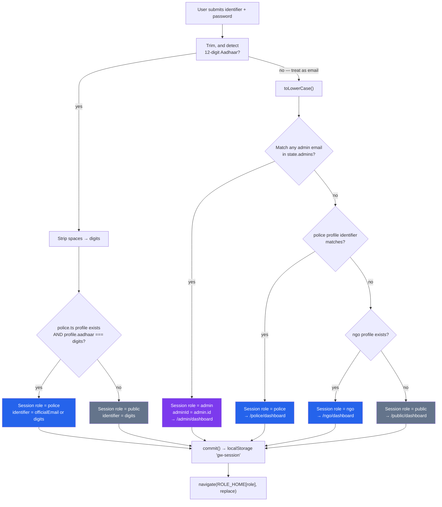

**Resolution precedence:** 12-digit Aadhaar → admin email → police identifier → NGO → public fallback.

> ⚠️ **Known bug (documented in §16):** the NGO branch returns the NGO session for *any* unmatched non-police email whenever an NGO profile exists — it never compares the typed value against `ngo.contactEmail`. Fix is a one-line `ngo.identifier.toLowerCase() === lower` check.

### 7.2 `continueAsPublic()` — the guest path

The login page has an explicit **"Continue as a public user"** button below an `or` divider. It creates `{ role: 'public', name: 'Public user', identifier: 'guest' }` and routes to `/public/dashboard`. **No password, no account.**

Copy shown: *"No account needed to browse the site, raise a missing-person complaint or track a case."*

### 7.3 `ROLE_HOME` and `ROLE_LABEL`

| role | `ROLE_HOME` | `ROLE_LABEL` |
|---|---|---|
| `public` | `/public/dashboard` | Public user |
| `police` | `/police/dashboard` | Police officer |
| `ngo` | `/ngo/dashboard` | NGO member |
| `admin` | `/admin/dashboard` | Verification admin |

### 7.4 `useCurrentAdmin()` — the admin identity hook

```ts
function useCurrentAdmin(): AdminAccount | null {
  const active = useSession()
  const state = useAdminConsole()
  if (!active || active.role !== 'admin') return null
  return state.admins.find((admin) => admin.id === active.adminId) ?? null
}
```

Returns `null` unless the session role is `admin` **and** the `adminId` resolves to a real account. Every admin page calls this and bails with `if (!admin) return null`.

### 7.5 Sign out — site-wide

Because login is unified, sign out appears **everywhere**, not just in portals.

| Location | Behaviour |
|---|---|
| `Header.tsx` account menu | **Primary** — avatar chip → dropdown → "Sign out" |
| `AdminLayout` sidebar footer | Secondary — always visible next to the identity card |
| `PanelLayout` (`showSignOut`) | No button — only the "Signed in as … · Role" line, to avoid a duplicate |

**Header account menu contents**

1. `session.name` (bold)
2. `ROLE_LABEL[session.role]` (brand-coloured)
3. `session.identifier` (muted, truncated)
4. **Go to my panel** → role-mapped dashboard
5. **Sign out** (rose) → `signOut()` → toast `Signed out.` → `/login` (replace)

When there is **no** session and the user is not in `/admin`, the header shows a **Log in** button instead.

### 7.6 Demo identity list

`demoIdentities(admins)` builds the clickable "demo logins" list on the login page:

| Entry | Source | Detail text |
|---|---|---|
| 3 admin rows | `state.admins` | `{state} · admin panel` |
| 1 police row | `policeSession()` — only if a police profile exists | `Police portal` |
| 1 NGO row | `ngoSession()` — only if an NGO profile exists | `NGO portal` |
| 1 public row | hardcoded | `Citizen portal`, identifier `9876543210` |

Clicking a row fills the identifier input; it does not log in.

### 7.7 Auth state machine

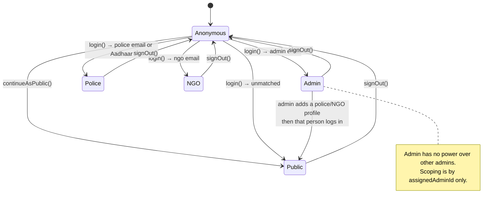

---

## 8. Journey 1 — Citizen Complaint Registration

The largest form in the app: **6 steps, 30 fields, 5 file uploads, 2 OTP verifications, 3 consents** — 35 interactive inputs in total.

### 8.1 Step flow

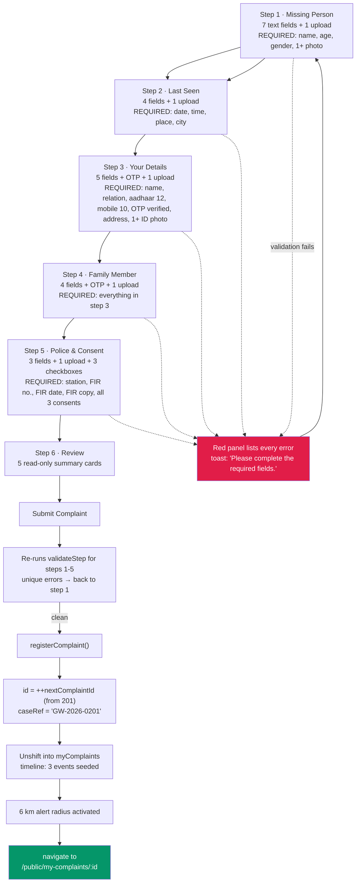

### 8.2 Step-by-step behaviour

| Step | Title | Navigable back? | Notes |
|---|---|---|---|
| 1 | Missing Person | — | Priority banner appears live once gender/age trigger a tag |
| 2 | Last Seen | ✅ | City uses `SearchableSelect` over 57 cities |
| 3 | Your Details | ✅ | OTP block appears after valid Aadhaar+mobile |
| 4 | Family Member | ✅ | Banner: *"A second family member is mandatory."* |
| 5 | Police & Consent | ✅ | Banner: FIR copy is **mandatory** |
| 6 | Review | ✅ | No validation; 5 cards, 2-column on `md` |

The step chips at the top are **clickable for completed steps only** (`disabled={item.id > step}`, `onClick` only when `item.id < step`). The progress bar width is `(step / 6) * 100%`. Every navigation calls `window.scrollTo({ top: 0, behavior: 'smooth' })`.

### 8.3 Auto-generated values on submit

| Field | Source | Fallback if blank |
|---|---|---|
| `id` | `++nextComplaintId` (starts 201) | — |
| `caseRef` | `` `GW-2026-${String(id).padStart(4, '0')}` `` | — |
| `status` | `'Active'` | — |
| `relation` | `complainantRelation` | — |
| `height` / `build` / `marks` / `clothing` | form | `'Not provided'` |
| `medicalNotes` | form | `'None.'` |
| `languages` | form | `'Not provided'` |
| `locality` | `lastSeenArea` | `'—'` |
| `circumstances` | form | `'Not provided'` |
| `updatedAt` | — | `'Just now'` |
| `latest` | — | `'Complaint registered. Alerts are active within a 6 km radius of the last seen location.'` |
| `personPhotos` | `personPhotos.length` | — |
| `hasComplainantId` / `hasMemberId` / `hasFirCopy` | `File[].length > 0` | — |
| `timeline[0..2]` | — | `done` / `current` / `pending` |

**Note:** the five `File[]` objects are **not persisted** — only their counts become booleans/counts. Refresh loses the images.

### 8.4 Complaint lifecycle

```mermaid
stateDiagram-v2
    [*] --> Active : registerComplaint()
    Active --> Matched : community sighting reported<br/>matchedDaysAgo = 0
    Matched --> Resolved : family confirms / case closed
    Matched --> Matched : deadline countdown runs<br/>daysLeft = 2 - matchedDaysAgo
    Resolved --> [*]

    note right of Matched
        A matched case MUST be updated
        within 2 days.
        daysLeft >= 0 → amber warning
        daysLeft < 0  → rose overdue warning
    end note
```

Progress dots use `doneCountFor()`: `Active → 1`, `Matched → 2`, `Resolved → 3` of the 3 steps `Opened / Sighting / Resolved`.

### 8.5 Privacy handling

`maskAadhaar()` renders `XXXX XXXX 9012` on the detail page. Mobile is prefixed `+91`. Full Aadhaar is never displayed after submission.

---

## 9. Journey 2 — Police / NGO Verification Lifecycle

This is the flow the user explicitly specified: **the admin provides the meeting link and the time. The user never does.**

### 9.1 End-to-end sequence

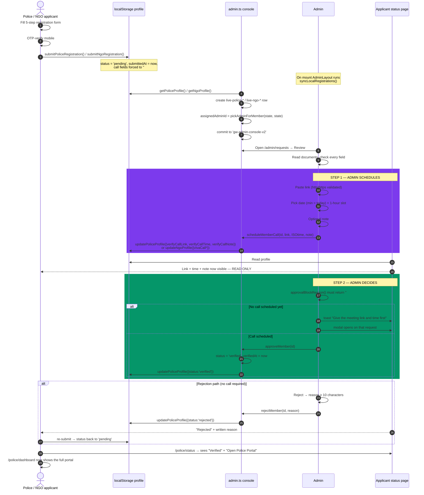

### 9.2 The 6-hour edit window

```mermaid
flowchart LR
    T0["submittedAt"] -->|"|-> W["6 hour window<br/>UPDATE_WINDOW_MS"]
    W --> OPEN["status page shows<br/>'Editable window closes in HH:MM:SS'"]
    OPEN --> EDIT["'Update Registration' link visible<br/>→ /police/register"]
    W -->|"expires"| CLOSED["'Update window closed.<br/>Contact the admin if a correction is needed.'"]
```

- Countdown ticks every 1000 ms via `useCountdown()`; formatted `HH:MM:SS` with `padStart(2,'0')`.
- When expired the value reads `Expired`.
- Enforcement is **UI-only** — the register page itself has no `isWithinUpdateWindow` check. See §16.

### 9.3 Status page states

| `status` | Heading | Body copy | Actions |
|---|---|---|---|
| `pending` | Pending admin approval | "Your registration has been received and is waiting for the admin to verify your service details." / "…your organisation over a viva call." | `Update Registration` (if window open) · `Reset demo profile` |
| `verified` | Verified | "Your account is verified. The full police portal is now open for you." | `Open Police Portal` / `Open NGO Portal` · `Reset demo profile` |
| `rejected` | Rejected | "The admin could not verify your details. Please review your information and submit again." | `Update & Resubmit` · `Reset demo profile` |

If no profile exists, both status pages `<Navigate>` back to their register page.

### 9.4 What the applicant sees about the call

**Police** — card `h3`: *"Verification video call with the admin"*
> "The admin schedules this call to verify your police ID and service documents. **You only need to join the call — no action required from you.**"

Badge: `Scheduled by admin` (green) or `Not scheduled yet` (grey)
Rows: `Video call link` · `Date & Time` · `Note`
Empty state: *"No verification call scheduled yet. The admin will schedule a link and time, and it will appear here."*

**NGO** — identical structure, `h3`: *"Viva video call with the admin"*
> "The admin schedules a short viva call to verify your organisation's documents. **You only need to join the call — no action required from you.**"

Both render the link as `<a target="_blank" rel="noreferrer">`. **Neither page contains any input that can write a link or a time** — that is the guarantee.

### 9.5 Dashboard gating

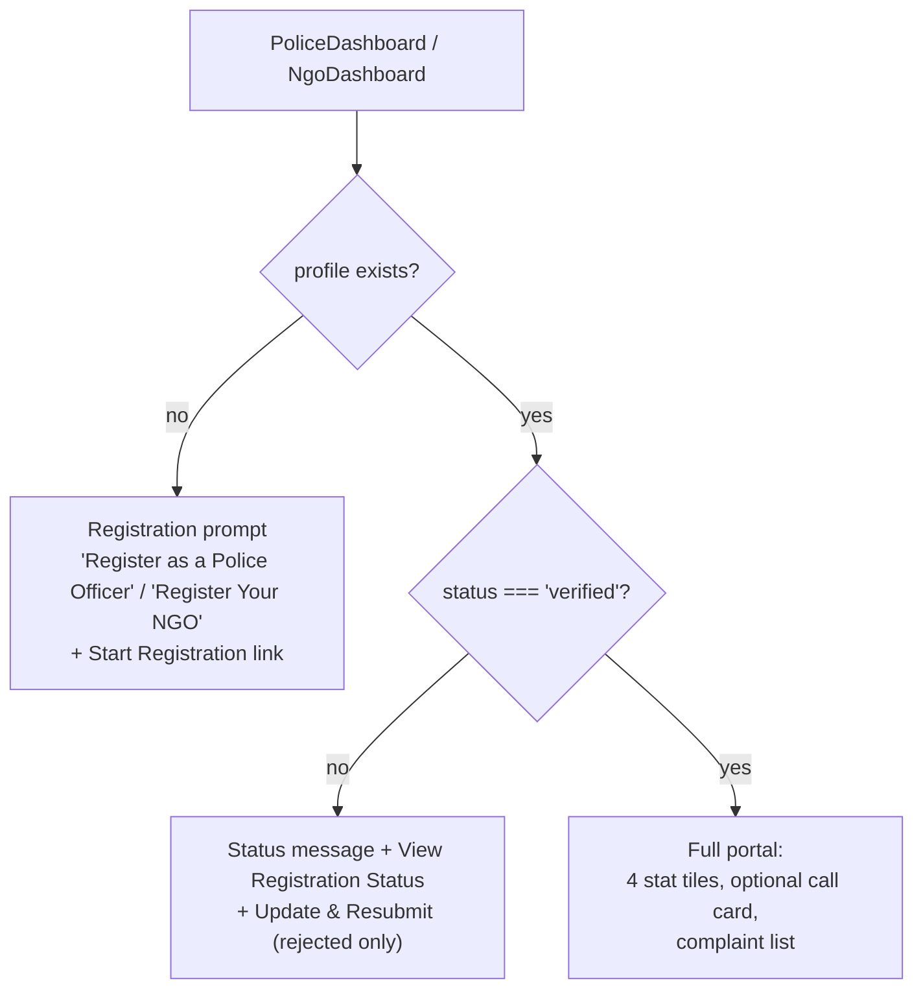

---

## 10. Journey 3 — Admin Verification Console

### 10.1 Layout structure

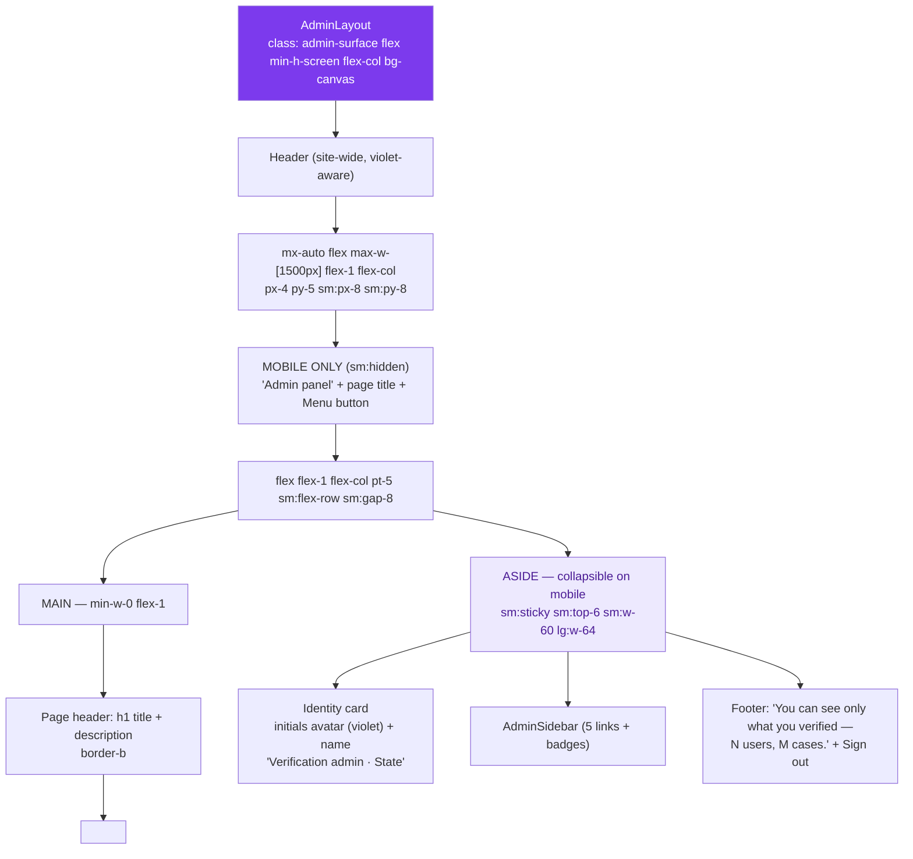

**Sidebar nav** (`AdminSidebar.tsx`, `NavLink` based, `aria-label="Admin sections"`)

| # | Label | Route | Badge source | Icon key |
|---|---|---|---|---|
| 1 | Overview | `/admin/dashboard` | — | `grid` |
| 2 | Requests | `/admin/requests` | `pendingRequests` | `inbox` |
| 3 | My Users | `/admin/my-users` | `myUsers` | `users` |
| 4 | Reports | `/admin/reports` | `openReports` | `flag` |
| 5 | Suspensions | `/admin/suspensions` | `activeSuspensions` | `ban` |

Badges are rose pills and are **hidden when the count is 0**. Active item: `bg-admin-600 text-white` with a violet glow shadow. Clicking any item collapses the mobile menu via the `onNavigate` callback.

**Page meta table** (drives the `h1` + description)

| Route | Title | Description |
|---|---|---|
| `/admin/dashboard` | Overview | "Your queue, your verified users and how their cases ended up." |
| `/admin/requests` | Requests | "Registrations assigned to you. You give the meeting link and time yourself, then approve or reject." |
| `/admin/my-users` | My Users | "Only the accounts you verified. Open any user to see all their cases and reports." |
| `/admin/reports` | Reports | "Complaints received against the accounts you verified." |
| `/admin/suspensions` | Suspensions | "Block an account with a written reason and proof, or lift an earlier suspension." |

Unknown paths fall back to the Overview meta.

### 10.2 Scoping — the core rule

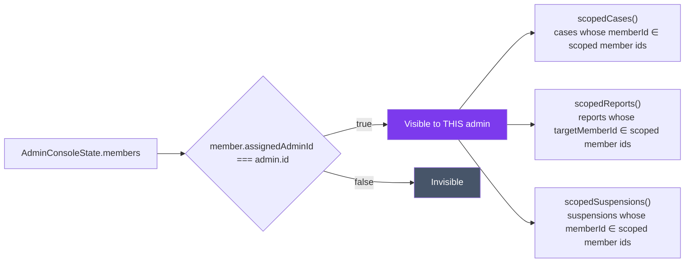

`canAccess(admin, member)` is a single strict equality — **no role check, no hierarchy, no override.** This is the entire permission model.

### 10.3 Page: Overview (`/admin/dashboard`)

| Stat tile | Value | Detail | Tone |
|---|---|---|---|
| Pending Requests | `pending.length` | Assigned to you, waiting for a decision | amber |
| My Users | `verified.length` | Accounts you verified | admin (violet) |
| Open Reports | `reports.filter(r => r.status !== 'closed').length` | Against your users | rose |
| Suspended | `suspensions.filter(s => s.status === 'active').length` | Blocked by you | default |

| Card | Subtitle | Action link |
|---|---|---|
| Waiting in your queue | "Oldest first. You give the meeting link and time, then approve or reject." | `Open queue` |
| Case results of your users | "Only cases belonging to the accounts you verified." | — |
| Latest reports | "A report is the starting point for any suspension." | `All reports` |
| Your users | "Each row shows how many cases that account created and how many produced the person." | `Open list` |

**Case-results mini-cards:** `Found` (emerald) · `Not found` (rose) · `Still open` (amber).
Summary line: `` `${total} cases in total · ${successRate}% recovery rate` `` + ` · average ${avgDays} days to find the person` when `avgDays > 0`. When `total === 0`: `"no closed case yet"`.

**Empty states:** `"Nothing pending. Every request assigned to you has been decided."` · `"No open report against your users."` · `"You have not verified any account yet."`

Queue is sorted **oldest first**; reports are sorted newest-first and **capped at 4**.

### 10.4 Page: Requests (`/admin/requests`)

This is where the meeting-link rule lives.

| Stat | Value | Detail | Tone |
|---|---|---|---|
| Pending | `counts.pending` | Waiting for a call and a decision | amber |
| Verified | `counts.verified` | Verified by you | emerald |
| Rejected | `counts.rejected` | Not verified, can be resubmitted | rose |

**Filter chips:** `Pending (n)` · `Verified (n)` · `Rejected (n)`, styled with `filterChipClass()`. Card title changes with the filter: `Pending requests` / `Verified accounts` / `Rejected requests`. List is sorted **newest first**.

**Row content**

| Element | Value |
|---|---|
| Role pill | `Police` (violet) or `NGO` (amber) |
| Call pill | `Call sent` (emerald) if `callLink && callTime` else `No call` (slate) |
| Name | `member.name` |
| Meta line 1 | `${roleLabel} · ${organisation} · ${state || 'State not given'}` |
| Meta line 2 | `${identifier} · applied ${timeAgo(submittedAt)}` |
| Buttons | `Review` (ghost) · `Approve` (emerald, pending only) |
| Call strip | `{callLink} · {formatSlot(callTime)}` when scheduled |
| Rejection strip | `Rejected: {rejectionReason}` when `status === 'rejected'` |

**Modal detail rows:** `Organisation` · `Role` · `Identifier` · `State` (`'Not provided'` fallback) · `Location` · `Mobile` (`'—'`) · `Email` (`'—'`) · `Applied` (`timeAgo`). Plus a `Documents submitted` chip list, or `"No document was uploaded with this request."`

#### The meeting-link block (the enforced rule)

Heading: **"Meeting link & time — you provide both"**

> "The user never picks a slot and never creates the link. You give the meeting link and the time, and it appears on their status page. **Approval stays locked until a call is scheduled.**"

| Control | Type | Validation → toast |
|---|---|---|
| Meeting link | text, placeholder `https://meet.google.com/...` | empty → *"You have to give the meeting link yourself."* · not `/^https?:\/\/\S+$/i` → *"Meeting link must start with http:// or https://"* |
| Date | `date` with `min={todayIso()}` | empty → *"Pick the date of the call."* · `NaN` parse → *"That date and time slot could not be read."* · **past** → *"Pick a future date and time for the call."* |
| Slot | `select`, 8 options | — |
| Note | text, `Note for the user (optional)` | — |

Buttons: `Schedule call` / `Update schedule` (when already scheduled) and `Clear` (only when scheduled → wipes all three fields, toast *"Call removed from the user's page."*).

When a call already exists, an **"Already sent to the user"** card shows the link and the formatted slot. Otherwise: *"No call scheduled yet."*

#### The approval gate

`verifyMember(member)` runs **before** every approval:

```ts
const blocked = approvalBlockReason(state, member.id)
if (blocked) { toast.error(blocked); setOpenId(member.id); return }
approveMember(member.id)
```

| `approvalBlockReason()` return | Trigger |
|---|---|
| `'This request no longer exists.'` | member id not found |
| `'This request has already been decided.'` | `status !== 'pending'` |
| `'Give the meeting link and time first — the user never picks their own slot.'` | `!callLink \|\| !callTime` |
| `''` | approvable → toast `` `${name} verified.` `` |

This applies to **both** the row-level `Approve` button and the modal `Approve account` button. The rule is in the data layer (`admin.ts`), not just the UI.

**Rejection path** — opens a rose block with a textarea. Minimum **10 characters** → *"Write a clear reason of at least 10 characters."* Success toast: *"Request rejected with a written reason."* **Rejection does not require a scheduled call** — only approval does.

### 10.5 Page: My Users (`/admin/my-users`)

| Stat | Value | Detail | Tone |
|---|---|---|---|
| Verified Users | `verified.length` | Verified by you | admin |
| Their Cases | `overall.total` | Every complaint they registered | default |
| Found | `overall.found` | Person identified and handed over | emerald |
| Not Found | `overall.notFound` | `` `${overall.open} still searching` `` | rose |

**Filters:** text search (matches name OR organisation OR state, case-insensitive) + role chips `All` / `Police` / `NGO`.

**Row:** role pill · `Active` (emerald) or `Suspended` (rose) · name · stat pills `{n} cases` · `{n} found` · `{n} not found` · `{n} open` (amber, only when > 0).

**User modal** — 4 mini-tiles (`Cases`, `Found`, `Not found`, `Recovery %` where `total === 0` shows `—`), then detail rows `Identifier` · `State / Location` · `Mobile` · `Email` · `Verification call` (`'{link} · {slot}'` or `'No call recorded'`) · `Documents` (`'None'` when empty). Then two lists: `All cases of this user` and `Reports against this user`, with empty states *"This account has not registered any case yet."* and *"No report has been filed against this account."*

**Case-result editor modal** (`Update case result`)

| Field | Control | Notes |
|---|---|---|
| Outcome | 3 chips: `Found` / `Not found` / `Still searching` | — |
| Days taken to find the person | `number`, `min={0}`, default `5` | **only rendered when outcome is `found`** |
| Note | textarea | min **5 characters** → *"Write a short note for the record."* |

Footer: `Cancel` · `Save` (violet). `setCaseOutcome()` forces `foundDays = 0` for any non-`found` outcome.

**Rejected section** appears only when `rejected.length > 0`, titled `Rejected` — *"Kept so you can compare if the same person registers again."*

**Suspend account** button in the modal footer navigates to `/admin/suspensions`.

### 10.6 Page: Reports (`/admin/reports`)

| Stat | Value | Detail | Tone |
|---|---|---|---|
| Total Reports | `reports.length` | Against the accounts you verified | admin |
| New | `status === 'open'` count | No action taken yet | rose |
| Closed | `status === 'closed'` count | Action finished | emerald |
| Proof Files | Σ `proof.length` | Screenshots and documents | default |

**Filters:** `All` · `New` · `Under review` · `Closed`. Sorted newest first, uncapped. Empty: *"No report in this filter."*

**Modal:** title `Report on {targetName}`. Detail rows `Reported account` · `Case` · `Category` · `Reported by` · `Filed` · `Status`. Then `What was reported` (free text) and `Proof from the reporter` (chip list, or the amber warning *"No proof attached. Ask the family for a screenshot before suspending anyone."*).

**Take action block** — status chips `Mark under review` / `Mark resolved` + a resolution textarea (min **5 characters** → *"Write what action was taken on this report."*). Previous notes render as `Previous note: {resolution}`.

`Suspend account` in the footer navigates to `/admin/suspensions`.

### 10.7 Page: Suspensions (`/admin/suspensions`)

| Stat | Value | Detail | Tone |
|---|---|---|---|
| Active | `active.length` | Accounts blocked right now | rose |
| Lifted | `lifted.length` | Reversed, kept for audit | emerald |
| Proof Files | Σ `proof.length` | Stored with each suspension | default |

**Advisory banner** — "Before you suspend anyone"
> "Three things are mandatory — the right account, a written reason, and at least one proof file. Both stay on record and the account holder can ask for a review later."

**Suspend modal** — read-only `Account` / `Organisation` / `Identifier` / `Mobile` rows, then:

| Field | Control | Validation |
|---|---|---|
| Reason category | `select`, 7 `suspensionReasons` | — |
| Written reason * | textarea | min **25 characters** → *"Write a proper reason of at least 25 characters. It stays on record."* Live character counter below |
| Proof * | file input (`multiple`) via dashed dropzone | at least 1 → *"Attach at least one proof file. A suspension without proof is not valid."* |
| Duration | `select` — Permanent / 7 / 15 / 30 / 90 days | — |
| Link reports against this account | checkbox list | optional |

Success: `suspendMember(...)` with `issuedBy` and `issuedById` from the current admin. Toast: `` `${name} suspended. Portal access is blocked.` ``

`durationDays === 0` → `endsAt = 0` → the row shows `Permanent` and `" · no end date"`. A dated suspension shows `" · ends {time} from now"`.

**Lift modal** — shows `Original reason` (read-only, never deleted) + a `Why is it being lifted` textarea (min **10 characters**). Success toast: *"Suspension lifted. The account can use the portal again."* The `Lifted suspensions` card is rendered only when `lifted.length > 0`, preserving the full audit trail.

Eligible accounts are `scopedMembers(...).filter(m => m.status !== 'rejected')` — i.e. you can suspend only accounts **you** verified, and only ones that were not already rejected. A suspended account shows `Blocked` in place of the button plus a `Suspended` pill.

## 11. Journey 4 — Report → Review → Suspension

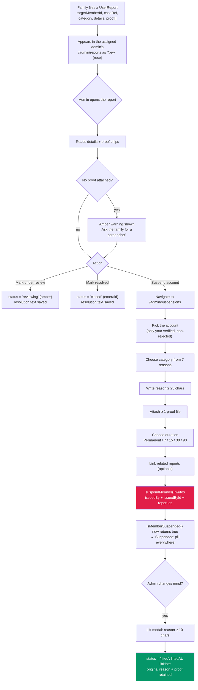

**Audit invariants**

- A suspension is never deleted — only lifted. `Lifted suspensions` keeps the row with `Original reason` and `Lift note`.
- The reason text and proof file names are stored on the suspension itself, so a later lift does not lose the evidence.
- Suspension always records **which admin** issued it (`issuedBy`, `issuedById`).

---

## 12. Complete Form Inventory

Every form in the app, with all fields and validation.

### 12.1 Login — `/login`

| Field | Control | State key | Validation | Error text |
|---|---|---|---|---|
| Email or Aadhaar Number | text, placeholder `you@example.com or 0000 0000 0000` | `identifier` | non-empty | "Enter your email or 12-digit Aadhaar number." |
| Password | password with show/hide toggle | `password` | non-empty | "Password is required." |

**Buttons:** `Log in` (submit) → `login()` → toast `` `Logged in as ${ROLE_LABEL[role]}.` `` → `navigate(ROLE_HOME[role], {replace:true})` · **`Continue as a public user`** → `continueAsPublic()` · `Create an account` → `/signup`.

**Also on the page:** already-signed-in banner with `Sign out now`; the demo identity list; `Forgot password?` link.

> The password value is read then discarded — `login()` contains `void password`. Any non-empty string works. This is intentional for the demo and is the single most important thing the backend must replace.

### 12.2 Sign up — `/signup` (2 steps)

**Step 1 — "Create your account"**

| Field | Control | State key | Validation | Error text |
|---|---|---|---|---|
| Full Name | text | `name` | non-empty | "Name is required." |
| Aadhaar Number | text, numeric, max 12 | `aadhar` | `/^\d{12}$/` | "Enter a valid 12-digit Aadhaar number." |
| Mobile Number | `tel`, numeric, max 10 | `mobile` | `/^\d{10}$/` | "Enter a valid 10-digit mobile number." |
| Password | password | `password` | `length >= 6` | "Password must be at least 6 characters." |

Buttons: `Continue` → step 2 · `Verify with DigiLocker` (toast: *"DigiLocker verification — coming soon (Demo)."*) · `Log in` link.
Left panel lists 3 benefits: `Raise & track complaints` · `Get 6 km alerts` · `Verified & private`.

**Step 2 — "Verify your identity"** — 6 separate single-character OTP boxes with auto-advance and Backspace-to-previous. Buttons: `Verify & Create Account` (needs 6 digits → *"Please enter the 6-digit OTP"*; success → *"Account created successfully (Demo). Welcome to Ghar Wapasi!"* → `/public/dashboard`) · `Resend OTP` · `Verify with DigiLocker`.

### 12.3 Forgot password — `/forgot-password` (2 steps)

| Step | Field | Control | Validation | Copy |
|---|---|---|---|---|
| 1 | Aadhaar Number | text, numeric, max 12 | `/^\d{12}$/` | toast `OTP sent to your linked mobile number (+91 {mobile})` |
| 2 | New Password | password | `length >= 6` | — |
| 2 | Confirm Password | password | must equal | — |

6-box OTP in between. Final success: *"Password updated successfully (Demo). Please log in."*

### 12.4 Complaint registration — 6 steps

**This is the most validation-dense form in the codebase.** Full field list in §8. Validation summary per step:

| Step | Required fields | Uploads | Other gates |
|---|---|---|---|
| 1 Missing Person | `personName`, `personAge`, `personGender` | `personPhotos` ≥ 1 | — |
| 2 Last Seen | `lastSeenDate`, `lastSeenTime`, `lastSeenPlace`, `lastSeenCity` | `locationPhotos` (optional) | — |
| 3 Your Details | `complainantName`, `complainantRelation`, `complainantAadhaar` (12), `complainantMobile` (10), `complainantAddress` | `complainantIdFile` ≥ 1 | **`complainantVerified`** |
| 4 Family Member | `memberName`, `memberRelation`, `memberAadhaar` (12), `memberMobile` (10) | `memberIdFile` ≥ 1 | **`memberVerified`** |
| 5 Police & Consent | `policeStation`, `firNumber`, `firDate` | `firCopy` ≥ 1 | **`consentTruth` + `consentShare` + `consentPolice`** |
| 6 Review | — | — | re-validates steps 1–5 |

**Complete field table**

| State key | Label | Control | Placeholder | Required |
|---|---|---|---|---|
| `personName` | Full name of missing person | TextInput | `e.g. Rohit Sharma` | ✅ |
| `personAge` | Age | TextInput numeric `maxLength=3` | `e.g. 34` | ✅ |
| `personGender` | Gender | SelectInput → `genderOptions` | — | ✅ |
| `personHeight` | Height | TextInput | `e.g. 5 ft 7 in` | — |
| `personBuild` | Build | TextInput | `e.g. Slim / Medium` | — |
| `personMarks` | Identifying marks | TextInput | `e.g. Scar on left eyebrow` | — |
| `personClothing` | Clothing last worn | TextInput | `e.g. Blue jacket, black trousers` | — |
| `personMedical` | Medical conditions / medication | TextAreaInput | `e.g. Needs insulin daily, speaks little` | — |
| `personLanguages` | Languages spoken | SearchableSelect → `indianLanguages` | `Search language...` | — |
| `personPhotos` | Photos of the missing person | PhotoUpload | — | ✅ ≥1 |
| `lastSeenDate` | Date last seen | `type=date` | — | ✅ |
| `lastSeenTime` | Time last seen | `type=time` | — | ✅ |
| `lastSeenPlace` | Last seen location | TextInput | `e.g. Old Delhi Railway Station` | ✅ |
| `lastSeenCity` | City / town | SearchableSelect → `indianCities` | `Search city...` | ✅ |
| `lastSeenArea` | Area / locality | TextInput | `e.g. Chandni Chowk` | — |
| `circumstances` | What happened? | TextAreaInput | `e.g. Left home to buy medicines…` | — |
| `locationPhotos` | Photos of the last seen location | PhotoUpload | — | — |
| `complainantName` | Your full name | TextInput | `e.g. Suresh Sharma` | ✅ |
| `complainantRelation` | Your relation to the missing person | SearchableSelect → `relationOptions` | `Search relation...` | ✅ |
| `complainantAadhaar` | Your Aadhaar number | TextInput numeric `maxLength=12` | `12-digit Aadhaar` | ✅ |
| `complainantMobile` | Your mobile number | TextInput numeric `maxLength=10` | `10-digit mobile` | ✅ |
| `complainantAddress` | Your full address | TextAreaInput | `House, street, city, PIN code` | ✅ |
| `complainantIdFile` | Your ID proof | PhotoUpload | — | ✅ ≥1 |
| `memberName` | Family member's full name | TextInput | `e.g. Anita Sharma` | ✅ |
| `memberRelation` | Their relation to the missing person | SearchableSelect → `relationOptions` | — | ✅ |
| `memberAadhaar` | Their Aadhaar number | TextInput numeric `maxLength=12` | — | ✅ |
| `memberMobile` | Their mobile number | TextInput numeric `maxLength=10` | — | ✅ |
| `memberIdFile` | Family member's ID proof | PhotoUpload | — | ✅ ≥1 |
| `policeStation` | Police station name | TextInput | `e.g. Rajendra Nagar Police Station` | ✅ |
| `firNumber` | Police complaint / FIR number | TextInput | `e.g. FIR/2026/0456` | ✅ |
| `firDate` | Police complaint / FIR date | `type=date` | — | ✅ |
| `firCopy` | Police complaint / FIR copy | PhotoUpload | — | ✅ ≥1 |
| `consentTruth` | Declaration | ConsentCheckbox | — | ✅ |
| `consentShare` | Sharing consent | ConsentCheckbox | — | ✅ |
| `consentPolice` | FIR confirmation | ConsentCheckbox | — | ✅ |

**Consent copy (verbatim)**

1. "I confirm that all the information provided above is true and correct. If any information is found false or fake, I understand that I will bear the legal consequences myself."
2. "I consent to sharing these details with the police and verified NGO partners for search and rescue purposes."
3. "I confirm that a police complaint has been filed and the attached copy is genuine."

**OTP blocks** — both use `DEMO_OTP = '123456'`. Send is enabled only when Aadhaar is 12 digits and mobile is 10. Verified state collapses to a green row.

### 12.5 Police registration — `/police/register` (5 steps)

| Step | Title | Fields |
|---|---|---|
| 1 | Officer Identity | `fullName`*, `rank`*, `badgeNumber`*, `stationName`*, `district`, `state`* |
| 2 | Contact & Aadhaar | `officialEmail`*, `aadhaar`*, `mobile`* + **OTP** |
| 3 | Service Proof | `employeeId`*, `joiningDate`*, `reportingOfficer`*, `reportingOfficerContact` + ID card photo* + appointment proof |
| 4 | Login Security | `password`* + `confirmPassword`* + consent* |
| 5 | Review | 3 read-only cards |

| Field | Control | Options / placeholder | Validation |
|---|---|---|---|
| `fullName` | TextInput | `e.g. Inspector Rajesh Kumar` | non-empty |
| `rank` | SearchableSelect | `policeRanks` (8) | non-empty |
| `badgeNumber` | TextInput | `e.g. DL-4821` | non-empty |
| `stationName` | TextInput | `e.g. Rajendra Nagar Police Station` | non-empty |
| `district` | TextInput | `e.g. Central Delhi` | — |
| `state` | SearchableSelect | `indianStates` (22) | non-empty |
| `officialEmail` | `type=email` | `e.g. rajesh.kumar@police.gov.in` | `/^[^\s@]+@[^\s@]+\.[^\s@]+$/` |
| `aadhaar` | numeric `maxLength=12` | `12-digit Aadhaar` | `length === 12` |
| `mobile` | numeric `maxLength=10` | `10-digit mobile` | `length === 10` + **OTP verified** |
| `employeeId` | TextInput | `e.g. EMP-2019-4471` | non-empty |
| `joiningDate` | `type=date` | — | non-empty |
| `reportingOfficer` | TextInput | `e.g. ACP Meena Joshi` | non-empty |
| `reportingOfficerContact` | numeric `maxLength=10` | `10-digit mobile` | — |
| `idCard` | PhotoUpload | `Clear photo of your identity card. Mandatory.` | ≥1 |
| `appointmentProof` | PhotoUpload | `Optional, but speeds up admin verification.` | — |
| `password` | `type=password` | `At least 6 characters` | `length >= 6` (create only) |
| `confirmPassword` | `type=password` | `Re-enter password` | must equal |
| `consent` | ConsentCheckbox | — | ✅ |

**Submit behaviour**

| Situation | Action | Toast | Navigate |
|---|---|---|---|
| No existing profile | `submitPoliceRegistration()` → `status: 'pending'` | "Registration submitted. It has been sent to the admin for verification." | `/police/status` |
| Existing, `rejected` | `savePoliceProfile({...input, status:'pending', submittedAt: now})` | "Registration resubmitted for admin approval." | `/police/status` |
| Existing, `pending`/`verified` | `savePoliceProfile({...profile, ...input})` — **status preserved** | "Registration details updated successfully." | `/police/status` |

Heading changes with `isEdit`: `Police Officer Registration` ↔ `Update Police Registration`; button `Submit Registration` ↔ `Save Changes`.

**Review cards:** `Officer Identity` · `Contact & Verification` (mobile shows `· verified`) · `Service Proof` (ID card `Uploaded`/`Not uploaded`, appointment `Uploaded`/`Optional`).

### 12.6 NGO registration — `/ngo/register` (5 steps)

| Step | Title | Fields |
|---|---|---|
| 1 | Organisation | `orgName`*, `orgType`, `regNumber`, `state`*, `district`, `city`, `address` |
| 2 | Contact Person | `contactPerson`*, `designation`, `contactMobile`* + **OTP**, `contactEmail`, `website` |
| 3 | KYC & Documents | `contactAadhaar` + reg certificate + org photo |
| 4 | Login Security | `password`* + `confirmPassword`* + consent* |
| 5 | Review | 3 read-only cards |

| Field | Control | Options / placeholder | Validation |
|---|---|---|---|
| `orgName` | TextInput | — | non-empty |
| `orgType` | SelectInput | `ngoOrgTypes` (6) | — |
| `regNumber` | TextInput | — | — |
| `state` | SearchableSelect | `indianStates` | non-empty |
| `district` / `city` | TextInput | — | — |
| `address` | TextAreaInput | — | — |
| `contactPerson` | TextInput | — | non-empty |
| `designation` | TextInput | — | — |
| `contactMobile` | numeric `maxLength=10` | `Verified with an OTP below.` | `length === 10` + **OTP verified** |
| `contactEmail` | TextInput | — | optional, but regex-checked **if provided** |
| `website` | TextInput | — | — |
| `contactAadhaar` | TextInput | `Optional, but it speeds up admin verification.` | — |
| `regCertificate` | PhotoUpload | `Files like registration / 12A / 80G certificate. Optional.` | — |
| `orgPhoto` | PhotoUpload | `Optional. A photo of office, volunteers, or a team photo.` | — |
| `password` / `confirmPassword` | password | `At least 6 characters` | ≥6 + match |
| `consent` | ConsentCheckbox | — | ✅ |

> The NGO OTP block uses `requireAadhaar={false}`, so only the 10-digit mobile gates the Send button. The text reads *"This mobile number must be verified with an OTP before you can continue."* instead of the Aadhaar variant.

Submit behaviour mirrors the police flow exactly (`pending` / `rejected` → `pending` / otherwise preserve).

**Review cards:** `Organisation` · `Contact Person` (mobile `· verified`) · `KYC & Documents` (contact Aadhaar `Provided (optional)` / `Not provided`).

### 12.7 Admin forms (all inside modals)

| Form | Location | Fields | Min lengths |
|---|---|---|---|
| Meeting schedule | Requests modal | link, date, slot, note | link required + `https?` + future date |
| Rejection reason | Requests modal | textarea | **10 chars** |
| Case result | My Users modal | outcome chips, days (found only), note | note **5 chars** |
| Report action | Reports modal | status chips, resolution textarea | **5 chars** |
| Suspension | Suspensions modal | category, reason, proof files, duration, linked reports | reason **25 chars**, proof **≥1 file** |
| Lift suspension | Suspensions modal | note textarea | **10 chars** |

### 12.8 Demo-only controls (must be removed before production)

These exist purely so a reviewer can see the whole flow without a second browser.

| Control | Location | Effect |
|---|---|---|
| `Reset demo profile` | Both status pages | Clears the local profile |
| `Search by Photo`, `Submit Sighting`, `Update Case`, `Mark as Resolved`, `Share with Police`, `Go to Your Portal` | Public pages | Toast `"<Feature> — Demo only. Full flow coming soon."` |
| `Try Photo Search`, `Get Started — It's Free` | Landing | Toast `"<label> — coming in the next step."` |
| `Verify with DigiLocker` | `SignupPage` | Toast `"DigiLocker verification — coming soon (Demo)."` |
| `Reset demo profile` (admin) | `resetAdminConsole()` | Not wired to any button currently |

> The `PoliceStatusPage` demo panel that let an officer schedule their own call and self-approve has been **removed**. Approval and call scheduling are now reachable only from the admin console, which matches the product rule. The practical consequence is that a police account can no longer reach `verified` without an admin session — use `/admin/requests` to approve, which is the intended path.

---

## 13. Page Inventory

### 13.1 Landing — `/`

Sticky header (`Logo` → `/`, `Login`, `Sign Up`, theme toggle). Sections:

| Section | Content |
|---|---|
| Hero | Eyebrow `Community Help Network` · `h1` "Help a missing person find their *way home*" · copy · `Get Started — It's Free` + `Try Photo Search` · avatar cluster from 4 helper names + `12,480 helpers registered around you` |
| Hero mock card | `Live alerts` / `radius · 6 km` · 2 alert rows (Meera Joshi 28 Female, Arjun Kumar 9 Child) with `2m` / `18m` badges · banner *"Every registered user within 6 km of the last seen location is notified instantly."* · pulsing amber dot |
| Stats band | `Registered Users 12,480` (+312 this week) · `Active Cases 232` (8 with priority alerts) · `Reunited 86` (5 today) · `Alert Radius 6 km` (around last seen spot) |
| Trust band | `Verified by police & NGOs` · `Location-aware alerts` · `Your privacy first` + `Read our guidelines →` |
| How It Works | `01 Report` · `02 Search & Alert` · `03 Reunite` |
| Features | `Raise a Complaint` · `AI Photo Search` · `Report a Sighting` · `Priority Alerts` + `Explore the features` |
| Recent Reports | 4 rows (Sunita Devi 64, Arjun Kumar 9, Meera Joshi 28, Ram Singh 45) + `View all reports` |

> `Login` / `Sign Up` are `<button>` elements here, **not** `<Link>`s.

### 13.2 Public dashboard — `/public/dashboard`

| Section | Content |
|---|---|
| Hero | `Community Help Network` pill · "Help someone find their way home" · 3 CTAs (`Raise a Complaint` link, `Search by Photo`, `Go to Your Portal`) · stat tiles: `Active Missing Cases 232`, `Reunited Families 86`, `Active Alert Radius 6 km` |
| 3 feature cards | `Report a Missing Person` (link) · `AI Photo Search` (demo toast) · `Report a Sighting` (demo toast) |
| Your Complaints | 4 complaint cards from `myComplaints` + `View All Complaints` + `Raise a New Complaint`. Per card: initials avatar, name, `caseRef · relation`, `StatusBadge`, 3-step progress dots, `age years · gender`, `lastSeen, area`, `Update Case` (demo), `Mark as Resolved` (demo, hidden when `Resolved`), `View Case` link |
| Priority Alerts | Amber callout: cases of *female, senior citizen, or child* broadcast to *every registered user* within 6 km |
| Recent Missing Reports | 4 hardcoded reports + `4 Reports` pill. `Priority Alert` pill when `priority === 'high'` |

### 13.3 My Complaints — `/public/my-complaints`

4 stat tiles (`Total Complaints` / `Active` / `Matched` / `Resolved`) then a 2-column grid where **the whole card is a link**.

For `Matched` complaints with `matchedDaysAgo` defined, a deadline strip appears:

| Condition | Copy | Colour |
|---|---|---|
| `daysLeft >= 0` | `Update status within 2 days (today)` or `· N day(s) left` | amber |
| `daysLeft < 0` | `Status update overdue by N day(s)` | rose |

### 13.4 Complaint detail — `/public|police|ngo/my-complaints/:id` (also `/complaints/:id`)

Left column cards, in order:

1. **Unnamed** — avatar, name, `Missing person · relation`, then `Full Name` · `Age / Gender` · `Height` · `Build` · `Identifying Marks` · `Clothing` · `Medical Notes` · `Languages`
2. **Last Seen** — `Date` · `Time` · `Place` · `City` · `Area / Locality` · `Circumstances`
3. **Complainant (You)** — `Full Name` · `Relation` · `Aadhaar` (masked) · `Mobile` (`+91 …`) · `Address`
4. **Second Family Member** — *"An alternate contact who can act on this case."* — `Full Name` · `Relation` · `Aadhaar` (masked) · `Mobile`
5. **Police Complaint** — `Police Station` · `FIR / Complaint No.` · `FIR Date`
6. **Documents** — *"Proofs submitted with this complaint."* — 4 rows with green check / grey cross: `Missing person photos` (`N uploaded` / `Not uploaded`) · `Complainant ID proof` · `Family member ID proof` · `Police complaint / FIR copy` (`Attached` / `Not attached`)
7. **Case Actions** — deadline banner (amber/rose) + `Update Case` · `Mark as Resolved` (hidden when Resolved) · `Share with Police`

Right column: **Case Timeline** — *"Official events for `{caseRef}`."* Each event has a coloured dot (`done` brand / `current` amber / `pending` slate), a `Completed` or `In progress` pill, and a date + detail. Empty dates and details are suppressed.

**Not found:** `Case not found` + "We could not locate a complaint matching this reference." + `Back to My Complaints`.

### 13.5 Police dashboard — `/police/dashboard`

Three mutually exclusive states (see §9.5). Verified view: heading `{rank} {fullName}`, subtitle `{stationName} · {district}, {state}`, `Register New Complaint` link → `/police/register-complaint`, 4 stat tiles, optional call card, then `Registered Complaints` 2-column grid. Each card adds FIR pills: `FIR {firNumber}` and `FIR copy attached` (emerald) / `FIR copy missing` (rose).

### 13.6 Police status — `/police/status`

See §9.3. 6 detail rows: `Rank` · `Badge No.` · `Station` · `District / State` · `Official Email` · `Mobile`. Plus the read-only call card. There is no self-approval control — see §12.8.

### 13.7 NGO dashboard — `/police/dashboard` (ngo variant)

Same three states. Verified view heading `{orgName}`, subtitle `{orgType} · {state}, {city}`, a `Verified NGO` pill, stat tiles labelled **`Total Cases`** (police uses `Total Complaints`), optional viva card, then `Community Cases` — *"Track and coordinate cases with families, the community, and the police."* Cards link to `/ngo/complaints/:id`. **No "register new complaint" link** — NGOs do not file cases.

### 13.8 NGO status — `/ngo/status`

Same three states. 6 detail rows: `Organisation` · `Type` · `Reg. Number` · `State / District` · `Contact Person` · `Mobile`. Viva card. **No demo controls panel** (asymmetric with police).

### 13.9 Info pages

`AboutPage`, `GuidelinesPage`, `ContactPage`, `PrivacyPage` all use the `InfoPage` component: props `eyebrow`, `title`, `description`, `infoCards?`, `sections: { heading, body: string[] }[]`. Each renders Header → eyebrow → `h1` → description → optional 2-column info-card grid → section cards → Footer.

### 13.10 Not found

`/not-found` and any unmatched path → `NotFoundPage` with Header + Footer.

### 13.11 Footer

Three link groups plus a tagline and a demo disclaimer.

| Group | Links |
|---|---|
| Portals | Public · Police · NGO · Admin |
| Get Involved | Raise a Complaint (`/public/register-complaint`) · AI Photo Search · Report a Sighting · Volunteer With Us (`/ngo/dashboard`) |
| Support | About Us · Guidelines · Contact · Privacy Policy |

Tagline: *"A community helping families find their way home."* Bar: `© {year} Ghar Wapasi. All rights reserved.` + `Demo build — dummy links`.

---

## 14. Business Rules Reference

### 14.1 Admin auto-assignment

`pickAdminForMember(state, memberState)` is a three-step algorithm:

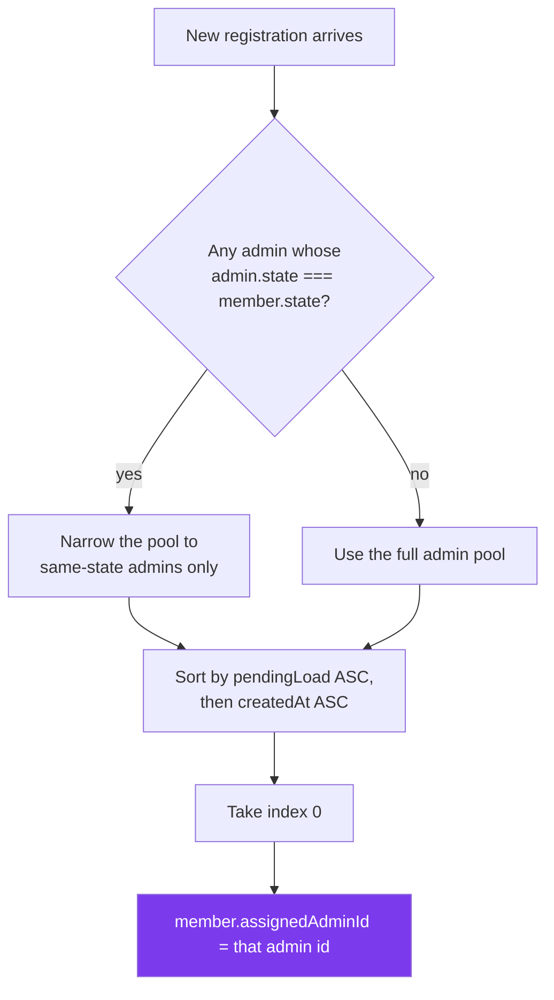

- **Same state first** — a Delhi registration prefers the Delhi admin.
- **Least pending load** — load balancing.
- **Oldest account wins ties** — deterministic, no random rotation.
- Seed verification: `pol-101` Delhi → Priyanka (Delhi) ✅ · `ngo-201` UP → Farah (UP) ✅ · `ngo-202` Karnataka → Sanjay (no Karnataka admin, least load) ✅

### 14.2 The meeting-link rule (the single most important business rule)

| # | Rule | Where enforced |
|---|---|---|
| 1 | The user cannot create a meeting link | No input exists on any police/NGO page that writes `verifyCall*` / `vivaCall*` |
| 2 | The user cannot pick a time slot | Slot options live only in the admin console |
| 3 | The admin must provide **both** link and time | `approvalBlockReason()` in `admin.ts` |
| 4 | Link must be a valid `http`/`https` URL | `saveCall()` regex |
| 5 | Date + time must be in the future | `saveCall()` `Date.now()` comparison + `min={todayIso()}` |
| 6 | Approval is blocked until a call is scheduled | Both `Approve` buttons → `verifyMember()` → `approvalBlockReason()` |
| 7 | Blocking opens the request so the admin can schedule it | `setOpenId(member.id)` |
| 8 | The admin may clear a call at any time | `Clear` button wipes all three fields |
| 9 | Rejection does **not** require a call | Rejection path has no `approvalBlockReason` check |
| 10 | Status indicator is emerald only when **both** fields exist | `callLink && callTime` everywhere |

### 14.3 Complaint rules

| # | Rule |
|---|---|
| 1 | A second family member with OTP-verified Aadhaar mobile is mandatory |
| 2 | A police complaint (FIR) number, date, and copy are mandatory |
| 3 | Three consents must be accepted: truthfulness, data sharing, FIR genuineness |
| 4 | At least one recent photo of the missing person is mandatory |
| 5 | Priority tags are derived, never chosen: Female, Child (`0 < age < 12`), Senior Citizen (`age >= 60`) |
| 6 | A matched case must be updated within **2 days** |
| 7 | Aadhaar is always masked as `XXXX XXXX 1234` after submission |
| 8 | `caseRef` is `GW-{year}-{4-digit id}` |
| 9 | `policeRanks`, `indianStates`, `indianLanguages`, `indianCities`, `relationOptions` are closed lists — free text is not accepted for those fields |

### 14.4 Suspension rules

| # | Rule | Min length |
|---|---|---|
| 1 | Account must be one you personally verified | — |
| 2 | Account must not already be `rejected` | — |
| 3 | Written reason required | **25 characters** |
| 4 | At least one proof file required | **1 file** |
| 5 | Category required (7 options) | — |
| 6 | Duration: permanent / 7 / 15 / 30 / 90 days | — |
| 7 | Issuer is recorded (`issuedBy`, `issuedById`) | — |
| 8 | Suspension is never deleted, only lifted | — |
| 9 | Lift note required | **10 characters** |
| 10 | Original reason + proof survive a lift | — |

### 14.5 Scoping rules

| # | Rule |
|---|---|
| 1 | `canAccess(admin, member)` is exactly `member.assignedAdminId === admin.id` |
| 2 | Cases, reports, and suspensions are scoped transitively through the member set |
| 3 | There is no role field on `AdminAccount` and no hierarchy |
| 4 | There is no super admin, no admin registration, and no `/admin/login` |
| 5 | `scopedMembers` is the only data source every admin page reads |

---

## 15. Backend Integration Points

This section is the hand-off list. Each row is a concrete place to change code.

### 15.1 Replace the session resolver

**File:** `src/data/session.ts` → `resolveAccount()`, `login()`

```ts
// Current — role decided entirely on the client
export function login(identifier: string, password: string, admins: AdminAccount[]): Session

// Target
export async function login(identifier: string, password: string): Promise<Session> {
  const res = await fetch('/api/auth/login', {
    method: 'POST',
    headers: { 'Content-Type': 'application/json' },
    body: JSON.stringify({ identifier, password }),
  })
  const { role, name, identifier: id, adminId, token } = await res.json()
  // store token, then commit({ role, name, identifier: id, adminId })
}
```

**Contract to request from the backend**

| Field | Type | Notes |
|---|---|---|
| `role` | `'public' \| 'police' \| 'ngo' \| 'admin'` | **Server-authoritative.** Never trust a client-supplied role. |
| `name` | string | Display name for the header chip |
| `identifier` | string | Echo of what was submitted |
| `adminId` | string | Only for `admin`; the backend must reject forged values |
| `token` | string | JWT or opaque session; store and send as `Authorization: Bearer` |

Also needed: `GET /api/auth/me` to hydrate a session on page load, and a real `POST /api/auth/forgot-password` + `POST /api/auth/reset-password` to replace the demo 3-step form.

### 15.2 Replace each store's `commit`

Every data module follows the same shape. The change is always the same: turn the mutation into a fetch, then write the server response into the cache.

| Module | Mutations to convert | Suggested endpoints |
|---|---|---|
| `session.ts` | `login`, `continueAsPublic`, `signOut` | `POST /api/auth/login`, `POST /api/auth/logout`, `GET /api/auth/me` |
| `police.ts` | `submitPoliceRegistration`, `updatePoliceProfile`, `scheduleVerificationCall` | `GET/POST/PATCH /api/police/profile` |
| `ngo.ts` | `submitNgoRegistration`, `updateNgoProfile`, `scheduleNgoViva` | `GET/POST/PATCH /api/ngo/profile` |
| `admin.ts` | `scheduleMemberCall`, `approveMember`, `rejectMember`, `setCaseOutcome`, `setReportStatus`, `suspendMember`, `liftSuspension` | `POST /api/admin/requests/:id/call`, `/approve`, `/reject`, `PATCH /api/admin/cases/:id`, `PATCH /api/admin/reports/:id`, `POST /api/admin/suspensions`, `POST /api/admin/suspensions/:id/lift` |
| `myComplaints.ts` | `registerComplaint` | `POST /api/complaints`, `GET /api/complaints` |

**Every admin endpoint must enforce scoping server-side.** `scopedMembers()` is a UI convenience, not a security control.

### 15.3 File uploads

`PhotoUpload` and the suspension dropzone hold real `File` objects in component state and discard them. They need `multipart/form-data` POSTs with progress. Minimum requirements:

- Complaint: 3 mandatory uploads (person photo, complainant ID, member ID) + 1 mandatory FIR copy + 1 optional location photo set.
- Police: ID card (mandatory) + appointment proof (optional).
- NGO: registration certificate + org photo (both optional).
- Suspension: ≥1 proof file, mandatory.
- Reports: proof screenshots from the reporter — **no upload UI exists yet**; this is a missing feature.

### 15.4 OTP

`DEMO_OTP = '123456'` is hardcoded in `RegisterComplaintPage`, `PoliceRegisterPage`, `NgoRegisterPage`, and `ForgotPasswordPage`. Replace `sendOtp` / `verifyOtp` with `POST /api/otp/send` and `POST /api/otp/verify`. Aadhaar-linked mobile confirmation should be validated by the UIDAI/Aadhaar API server-side.

### 15.5 Things the backend must own regardless of the frontend

| Concern | Why it cannot stay client-side |
|---|---|
| Role resolution | A client can edit `localStorage` freely |
| Admin scoping | `scopedMembers` is a filter, not a permission |
| Suspension enforcement | Suspended accounts must be rejected at login and on every API call |
| Aadhaar masking | Do not send full Aadhaar to the browser at all after OTP verification |
| Document storage | Uploads are personal data; they need encryption, retention, and audit |
| Rate limiting | OTP and login endpoints |
| Audit log | Approvals, rejections, and suspensions are legally significant actions |

### 15.6 Features currently stubbed with a toast

These are declared in the UI but not implemented:

`AI Photo Search` · `Report a Sighting` · `Update Case` · `Mark as Resolved` · `Share with Police` · `DigiLocker verification` · `UserReport` submission (no public-facing form exists) · `reportCategories` (8 options, exported but unused) · Admin account creation (intentionally removed)

---

## 16. Known Gaps, Risks & Deviations

### 16.1 Defect register

✅ = fixed in this build · 🔴 = open

| # | | Severity | Location | Issue |
|---|---|---|---|---|
| 1 | ✅ | **High** | `src/data/session.ts:112` | The NGO branch returned the NGO session for **any** unmatched non-police email whenever an NGO profile existed — it never compared against `ngo.contactEmail`. **Fixed:** now `if (ngo && ngo.identifier.toLowerCase() === lower) return ngo`. |
| 2 | ✅ | **High** | `src/pages/police/PoliceStatusPage.tsx` | The demo panel let a **police officer set their own** `verifyCallLink` / `verifyCallTime` and self-approve, contradicting the admin-provides-the-link rule. **Fixed:** the whole panel, its `setStatus` handler, and the three schedule state hooks were deleted. |
| 3 | ✅ | Medium | `VerificationRequestsPage.tsx:41`, `MyUsersPage.tsx:63` | `selected = state.members.find(m => m.id === openId)` searched the **unscoped** member array, so a crafted `openId` could open another admin's record. **Fixed:** both now search `members` (the `scopedMembers` result). The modals already gate on `open={Boolean(selected)}`, so an out-of-scope id simply renders nothing. |
| 4 | 🔴 | Medium | `PoliceRegisterPage.tsx`, `NgoRegisterPage.tsx` | The 6-hour edit window is displayed but **not enforced** — the register pages do not call `isWithinUpdateWindow`. The links are hidden after expiry, but a direct URL visit still works. |
| 5 | 🔴 | Medium | `src/data/admin.ts` → `read()` | The versioned key `gw-admin-console-v2` has **no migration**. Browsers holding data from the pre-super-admin-removal build still contain `adm-super` and members assigned to it, which no admin can see. Add a migration or bump the key. |
| 6 | 🔴 | Low | `src/data/myComplaints.ts` | Complaints are module memory only — a page reload discards anything the user just filed. |
| 7 | 🔴 | Low | `src/data/admin.ts` → `suspendMember` | Nothing checks for an existing `active` suspension before creating a second one for the same member. |
| 8 | 🔴 | Low | `MyUsersPage` | `filtered` includes `rejected` members in the main list because it filters only on `scopedMembers`; the separate `Rejected` card also lists them. |
| 9 | 🔴 | Low | `PoliceDashboard` / `NgoDashboard` | Suspension is not checked — a suspended but previously-verified account can still open the portal. |
| 10 | 🔴 | Low | `src/data/session.ts` → `useSession` | There is no expiry. `gw-session` persists until explicit sign-out, and a tampered `role`/`adminId` is accepted as long as it is one of the four known roles. |
| 11 | ℹ️ | Info | `src/data/admin.ts` | `reportCategories` (8 entries) is exported but no page uses it. |
| 12 | ℹ️ | Info | Route guards | Only `/admin/*` is session-guarded. `/public/*`, `/police/*`, `/ngo/*` are directly reachable. Add a `RequireRole` wrapper. |
| 13 | ℹ️ | Info | Build | `dist/assets/index-*.js` is ~559 kB (142 kB gzipped) — over Vite's 500 kB warning threshold. Add `React.lazy` per route. |

> Items 4–10 are all *client-side* weaknesses. In a server-backed build every one of them becomes a server responsibility, which is why §15.2 insists that scoping, suspension, and role resolution must be enforced by the API rather than by these stores.

### 16.2 Intentional frontend-only decisions

| Decision | Reason |
|---|---|
| No super admin | Explicit product decision. Admins are peers. |
| No role picker on login | Role must come from the backend, not the user. |
| Any non-empty password accepted | Demo only. `void password` marks the exact seam to replace. |
| Demo identity list on the login page | Reviewer convenience; delete with the demo. |
| Approval blocked until a call is scheduled | Product requirement. |
| Admin-only meeting link and time | Product requirement. |
| Violet admin theme | Visual separation between the citizen site and the internal console. |
| `GW-2026-` hardcoded year in `caseRef` | Fine for a demo; derive from the current year in production. |

### 16.3 Accessibility notes

Present: `aria-label` on every icon-only button, `aria-expanded` / `aria-haspopup` / `role="menu"` on the account dropdown, `role="dialog"` + `aria-modal` on modals, `aria-label` per OTP digit, `NavLink` `isActive` for sidebar state, visible focus rings via `focus:ring-2`.

Gaps: no focus trap in `AdminModal` (Tab can escape to the page behind), no `Esc` to close any modal, no skip-to-content link, no `aria-live` on the countdown, `Alt` em dashes in some labels render as `&amp;` in raw HTML.

---

## 17. File Index

### Data / state

| File | Responsibility |
|---|---|
| `src/data/session.ts` | `UserRole`, `Session`, `ROLE_HOME`, `ROLE_LABEL`, `resolveAccount`, `login`, `continueAsPublic`, `signOut`, `useSession`, `useCurrentAdmin`, `demoIdentities` |
| `src/data/admin.ts` | All 5 admin entity types, `callSlots`, `reportCategories`, `suspensionReasons`, `syncLocalRegistrations`, `pickAdminForMember`, all mutations, `scoped*` selectors, `tallyCases`, `timeAgo`, `formatSlot`, `approvalBlockReason` |
| `src/data/police.ts` | `PoliceProfile`, `submitPoliceRegistration`, `updatePoliceProfile`, `scheduleVerificationCall`, `UPDATE_WINDOW_MS`, `formatCallTime` |
| `src/data/ngo.ts` | `NgoProfile`, `submitNgoRegistration`, `updateNgoProfile`, `scheduleNgoViva`, `ngoOrgTypes`, `formatVivaTime` |
| `src/data/myComplaints.ts` | `MyComplaint`, `CaseEvent`, `registerComplaint`, `getInitials`, `doneCountFor`, `maskAadhaar`, `matchDeadline` |
| `src/data/options.ts` | `genderOptions`, `policeRanks`, `indianStates`, `relationOptions`, `indianLanguages`, `indianCities` |

### Routing

`src/routes/AppRoutes.tsx` · `publicRoutes.tsx` · `policeRoutes.tsx` · `ngoRoutes.tsx` · `adminRoutes.tsx`

### Layouts & guards

`src/layouts/AdminLayout.tsx` (guard + sidebar + page meta) · `PanelLayout.tsx` · `PublicLayout.tsx` · `PoliceLayout.tsx` · `NgoLayout.tsx`

### Shared components

`Header.tsx` (site-wide account menu) · `Footer.tsx` · `InfoPage.tsx` · `FormControls.tsx` · `SearchableSelect.tsx` · `StatusBadge.tsx` · `StatCard.tsx` · `ThemeToggle.tsx` · `Logo.tsx` · `formStyles.ts`

### Admin components

`AdminUi.tsx` (`ConsoleStat`, `SectionCard`, `Pill`, `DetailRow`, `ActionButton`) · `AdminModal.tsx` (mobile bottom sheet) · `AdminSidebar.tsx` (5 nav items + badges) · `adminStyles.ts` (`filterChipClass`, `adminLinkClass`)

### Pages

`landing/LandingPage` · `auth/LoginPage` `SignupPage` `ForgotPasswordPage` · `public/PublicDashboard` `MyComplaintsPage` `MyComplaintDetailPage` `RegisterComplaintPage` `AboutPage` `GuidelinesPage` `ContactPage` `PrivacyPage` · `police/PoliceDashboard` `PoliceRegisterPage` `PoliceStatusPage` · `ngo/NgoDashboard` `NgoRegisterPage` `NgoStatusPage` · `admin/AdminDashboard` `VerificationRequestsPage` `MyUsersPage` `ReportsPage` `SuspensionsPage` · `NotFound/NotFoundPage`

### Styling

`src/index.css` — Tailwind v4 `@theme` block (brand + admin ramps, fonts, canvas/surface), dark palette overrides, `.admin-surface` canvas tint, `@custom-variant dark`

### Related documentation

`project-summary.txt` — chronological build log (sections 1–22) with the reasoning behind each change

---

## Appendix A — Command reference

| Command | Purpose |
|---|---|
| `npm run dev` | Vite dev server |
| `npm run build` | `tsc -b` typecheck + production build |
| `npm run lint` | ESLint (includes `react-hooks` rules) |
| `npm run preview` | Serve the production build locally |

**To reset all demo data**, clear these keys in DevTools → Application → Local Storage:

```js
localStorage.removeItem('gw-admin-console-v2')
localStorage.removeItem('gw-police-profile')
localStorage.removeItem('gw-ngo-profile')
localStorage.removeItem('gw-session')
```

Then reload. `gw-admin-console-v2` re-seeds automatically. Note that `myComplaints` resets on every reload regardless.

## Appendix B — Quick demo script (5 minutes)

1. `npm run dev`, open `/login`.
2. Click a **Priyanka Nair** demo row → `Continue` → land on the violet admin Overview. Note the 4 stat tiles and the queue.
3. `/admin/requests` → open `Devendra Singh` → try `Approve` **without** a call → blocked: *"Give the meeting link and time first — the user never picks their own slot."*
4. Paste `https://meet.google.com/gw-verify-88214`, pick tomorrow + `11:00 AM – 12:00 PM`, add a note, `Schedule call` → `Approve` now works.
5. Open the Header account menu → `Sign out` → back at `/login`.
6. Go to `/police/register`, fill the 5 steps (OTP = `123456`) → `/police/status` shows the call the admin just scheduled, **read-only**.
7. Back at `/public/register-complaint`, walk the 6 steps to file a complaint, then open `/public/my-complaints/:id` and check the masked Aadhaar and the timeline.
8. Toggle the theme — the admin console keeps its violet canvas tint in both modes.

